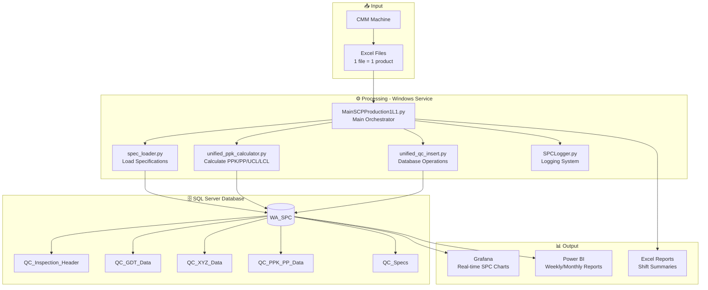
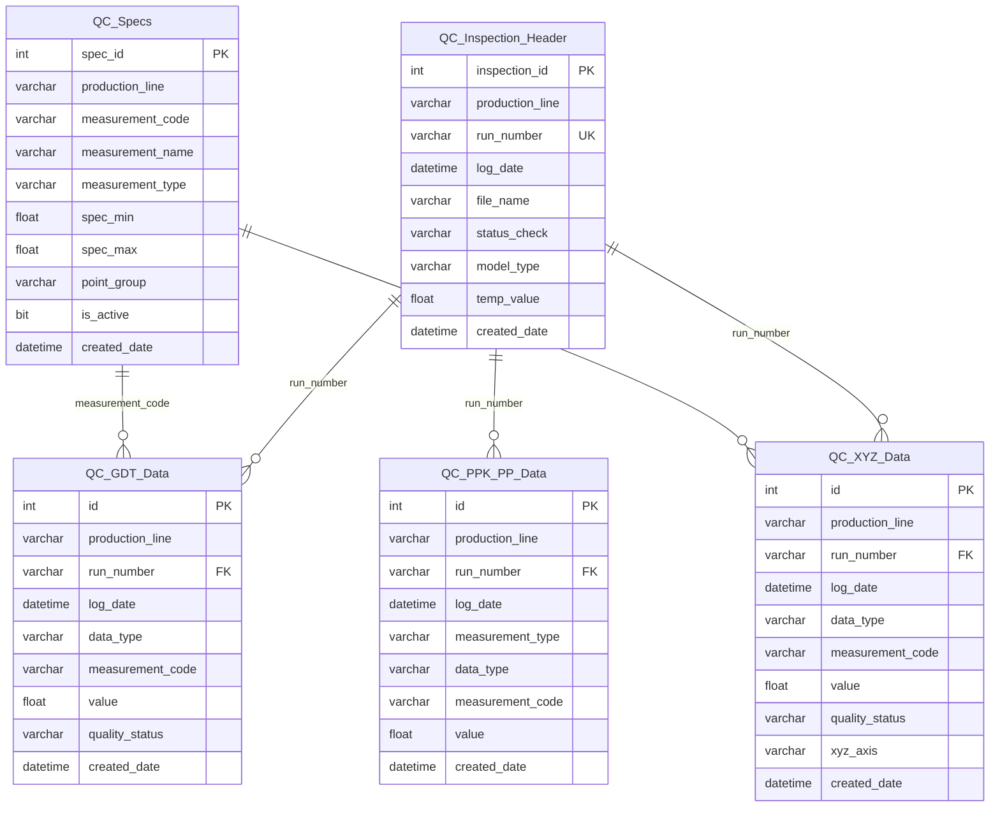
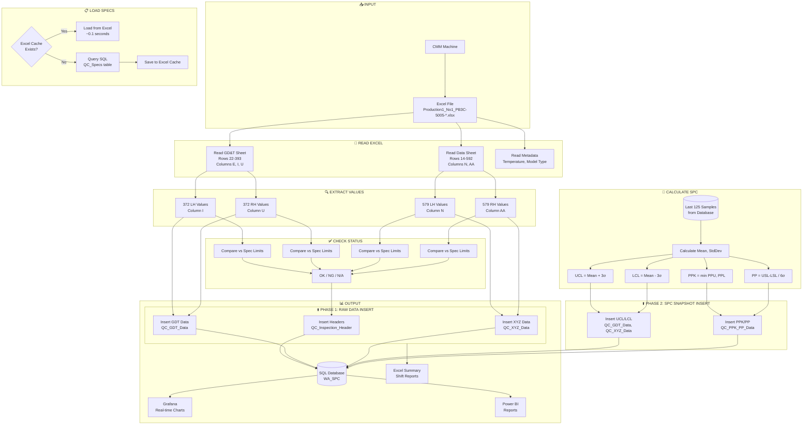
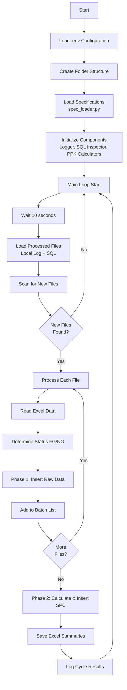
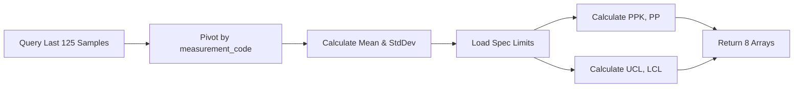
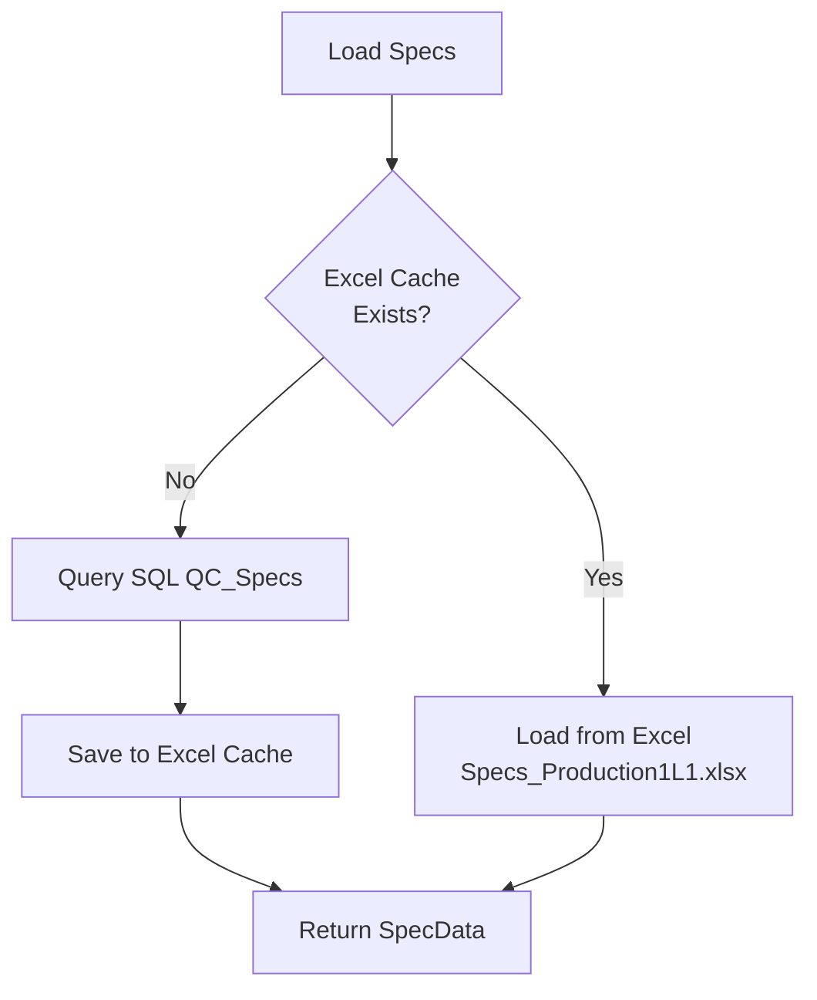
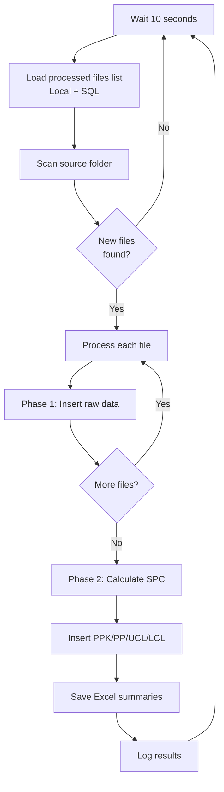
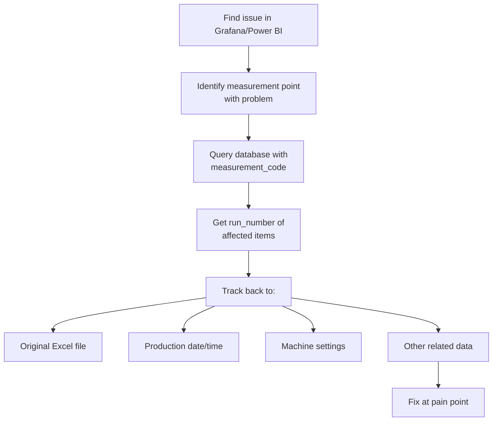

# SPC Real-Time Monitoring System

Quality data collection and analysis system for production lines.

---

> ⚠️ **NOTICE: Documentation Only**
> 
> This repository contains documentation and architecture explanation only.
> All data (IP addresses, database names, credentials, file paths) are **examples only** for demonstration purposes.
> 
> **Source code is proprietary and not included in this repository.**

---

## Table of Contents

1. [Overview](#1-overview)
2. [System Architecture](#2-system-architecture)
3. [Database Design](#3-database-design)
4. [Data Flow](#4-data-flow)
5. [Code Structure](#5-code-structure)
6. [Key Features](#6-key-features)
7. [Installation](#7-installation)
8. [Configuration](#8-configuration)
9. [Usage](#9-usage)
10. [Visualization](#10-visualization)
11. [Traceability](#11-traceability)
12. [Adding New Production Line](#12-adding-new-production-line)
13. [Troubleshooting](#13-troubleshooting)

---

## 1. Overview

This system is part of a quality improvement project. It makes inspection data more accessible and uses that data to analyze issues and find ways to improve production.

### What This System Does

- Collects inspection data from CMM (Coordinate Measuring Machine) Excel files in real-time
- Extracts GD&T (Geometric Dimensioning & Tolerancing) measurements
- Extracts XYZ coordinate measurements
- Calculates PPK (Process Performance Index) and PP values
- Calculates UCL (Upper Control Limit) and LCL (Lower Control Limit)
- Determines quality status (OK/NG) by comparing values against specification limits
- Stores all data in SQL Server database
- Generates Excel summary reports by shift
- Displays real-time SPC charts on Grafana
- Provides data for Power BI reports

### Who Uses This System

| User | Purpose |
|------|---------|
| QC Team | Monitor real-time SPC at shopfloor |
| Engineering | Analyze issues and improve process |
| Management | Review weekly/monthly quality reports |

### Key Numbers

| Item | Value |
|------|-------|
| GD&T measurement points | 372 per side (LH/RH) |
| XYZ measurement points | 579 per side (LH/RH) |
| Samples for PPK calculation | Last 125 items |
| SQL tables | 5 universal tables |
| Data per inspection | ~3,400 rows |

---

## 2. System Architecture

### System Flow Diagram



### How It Works

The system runs as a **Windows Service** on a PC at the shopfloor. It automatically:

1. **Scans** for new Excel files from CMM machine output folder
2. **Reads** GD&T data (372 points) and XYZ data (579 points)
3. **Loads** specification limits from SQL (with Excel caching for speed)
4. **Checks** quality status (OK/NG) for each measurement
5. **Calculates** PPK, PP, UCL, LCL using last 125 samples
6. **Inserts** all data to SQL database in two phases
7. **Generates** shift summary Excel reports
8. **Logs** all activities to console and Excel

### Processing Phases

The system uses a **two-phase insert** for better performance:

| Phase | What Gets Inserted | When |
|-------|-------------------|------|
| Phase 1 | Headers + Raw measurements (GDT, XYZ) | Per file |
| Phase 2 | SPC snapshot (PPK, PP, UCL, LCL) | After batch |

This approach calculates SPC values once per cycle instead of per file.

---

## 3. Database Design

### Database Schema



### Universal Table Design

We use **5 universal tables** for ALL production lines. Each table has `production_line` column to separate data.

| Table | Purpose | Rows per Inspection |
|-------|---------|---------------------|
| `QC_Inspection_Header` | File metadata, status | 2 (LH + RH) |
| `QC_GDT_Data` | GD&T measurements + UCL/LCL | ~2,976 |
| `QC_XYZ_Data` | XYZ coordinates + UCL/LCL | ~4,632 |
| `QC_PPK_PP_Data` | PPK/PP calculation results | ~3,804 |
| `QC_Specs` | Specification limits | Reference table |

### Data Types in Tables

**QC_GDT_Data.data_type:**
| Value | Description |
|-------|-------------|
| LH | Left-hand measurement value |
| RH | Right-hand measurement value |
| LH UCL | Left-hand Upper Control Limit |
| LH LCL | Left-hand Lower Control Limit |
| RH UCL | Right-hand Upper Control Limit |
| RH LCL | Right-hand Lower Control Limit |

**QC_XYZ_Data.data_type:**
| Value | Description |
|-------|-------------|
| LH | Left-hand measurement (xyz_axis = X, Y, or Z) |
| RH | Right-hand measurement (xyz_axis = X, Y, or Z) |
| LH UCL | Left-hand Upper Control Limit |
| LH LCL | Left-hand Lower Control Limit |
| RH UCL | Right-hand Upper Control Limit |
| RH LCL | Right-hand Lower Control Limit |

**QC_XYZ_Data.xyz_axis:**
| Value | Description |
|-------|-------------|
| X | X-axis coordinate |
| Y | Y-axis coordinate |
| Z | Z-axis coordinate |
| N | Nominal/other (no axis suffix in code) |

### Quality Status Logic

For each measurement value, the system checks against specification limits:

```
IF spec_min <= value <= spec_max THEN status = "OK"
IF value < spec_min OR value > spec_max THEN status = "NG"
IF spec_min = 0 AND spec_max = 0 THEN status = "N/A" (no spec defined)
```

### Why Universal Design?

- ✅ One set of tables for ALL lines
- ✅ Easy to compare data across lines
- ✅ Add new line = just add data with new `production_line` value
- ✅ No need to create new tables for new line
- ✅ Grafana/Power BI queries work automatically

---

## Data Volumes

Estimated data growth per day (assuming 100 inspections/day):

| Table | Rows/Inspection | Rows/Day | Rows/Month |
|-------|-----------------|----------|------------|
| QC_Inspection_Header | 2 | 200 | 6,000 |
| QC_GDT_Data | ~2,976 | ~297,600 | ~8,928,000 |
| QC_XYZ_Data | ~4,632 | ~463,200 | ~13,896,000 |
| QC_PPK_PP_Data | ~3,804 | ~380,400 | ~11,412,000 |
| **Total** | **~11,414** | **~1,141,400** | **~34,242,000** |

**Note:** Database grows approximately 500MB-1GB per month per production line. Plan disk space accordingly.

---

## 4. Data Flow

### Complete Data Flow Diagram



### Step-by-Step Process

| Step | Component | Description |
|------|-----------|-------------|
| 1 | CMM Machine | Outputs Excel file with measurement data |
| 2 | MainSCPProduction1L1.py | Scans folder for new files (every 10 seconds) |
| 3 | Filename Filter | Validates pattern: `Production1_No1_PB3C-5005-*.xlsx` |
| 4 | Duplicate Check | Checks local log + SQL database |
| 5 | Read Excel | Extracts GD&T (372) and XYZ (579) values |
| 6 | Load Specs | From Excel cache or SQL QC_Specs |
| 7 | Check Status | Compare each value against spec limits |
| 8 | Phase 1 Insert | Headers + raw measurements |
| 9 | Calculate SPC | PPK, PP, UCL, LCL from last 125 samples |
| 10 | Phase 2 Insert | SPC snapshot for all files in batch |
| 11 | Save Excel | Shift summary reports |
| 12 | Log | Record to console and Excel log |

---

## 5. Code Structure

### File Overview

```
Project/
├── MainSCPProduction1L1.py          # Main script for Production Line 1
├── MainSCPProduction1L2.py          # Main script for Production Line 2 (same logic)
├── unified_qc_insert.py      # Database insert operations (V7)
├── unified_ppk_calculator.py # PPK/PP calculation engine
├── spec_loader.py            # Specification loading with caching
├── SPCLogger.py              # Logging system
├── header_definitions.py     # Measurement code headers
├── spec_limit_Production1.py        # Spec limits (legacy, now in SQL)
├── .env                      # Environment configuration
└── Production1L1_Log/               # Output folder (auto-created)
    ├── Logs/                 # Activity logs
    ├── Output/               # Shift summary Excel files
    └── Specs/                # Cached specification Excel
```

### Component Details

#### MainSCPProduction1L1.py - Main Orchestrator



**Key Configuration (DATA_MAP):**

| Setting | Value | Description |
|---------|-------|-------------|
| gdt_sheet | "GD&T Data" | Sheet name for GD&T |
| gdt_cols | "E,I,U" | Column E=codes, I=LH, U=RH |
| gdt_skiprows | 21 | Start at row 22 |
| gdt_nrows | 372 | Read 372 rows (22-393) |
| data_sheet | "Data" | Sheet name for XYZ |
| data_cols | "N,AA" | Column N=LH, AA=RH |
| data_skiprows | 13 | Start at row 14 |
| data_nrows | 579 | Read 579 rows (14-592) |
| meta_sheet | "A" | Metadata sheet |
| temp_cell | "H7" | Temperature cell |
| model_cell | "G2" | Model type cell |

---

#### unified_qc_insert.py - Database Operations (V7)

**Key Features:**
- Duplicate detection before insert (checks SQL + local log)
- Status check using measurement_code lookup
- Batch insert with `executemany` for performance
- Separate xyz_axis column for XYZ data (V7 change)

**Main Methods:**

| Method | Description |
|--------|-------------|
| `insert_headers_batch()` | Insert to QC_Inspection_Header |
| `insert_gdt_batch()` | Insert GDT measurements + UCL/LCL |
| `insert_xyz_batch()` | Insert XYZ measurements (with xyz_axis) |
| `insert_xyz_ucl_lcl_batch()` | Insert XYZ control limits |
| `insert_ppk_batch()` | Insert PPK/PP values |
| `get_gdt_status()` | Check status using spec lookup |
| `get_xyz_status()` | Check status using spec lookup |
| `get_processed_filenames()` | Get already processed files from SQL |

**V7 Change - XYZ Data Type:**

Before V7:
```
data_type = "LH X", "LH Y", "LH Z", "RH X", etc.
```

After V7:
```
data_type = "LH" or "RH"
xyz_axis = "X", "Y", "Z", or "N" (separate column)
```

---

#### unified_ppk_calculator.py - PPK Calculation

**Calculation Flow:**



**Formulas:**

| Value | Formula |
|-------|---------|
| UCL | Mean + 3 × StdDev |
| LCL | Mean - 3 × StdDev |
| PPU | (USL - Mean) / (3 × StdDev) |
| PPL | (Mean - LSL) / (3 × StdDev) |
| PPK | min(PPU, PPL) |
| PP | (USL - LSL) / (6 × StdDev) |

**Return Values:**

Returns tuple of 8 lists (all same length as headers):
1. `lh_ppks` - LH PPK values
2. `rh_ppks` - RH PPK values
3. `lh_pps` - LH PP values
4. `rh_pps` - RH PP values
5. `lh_ucls` - LH Upper Control Limits
6. `lh_lcls` - LH Lower Control Limits
7. `rh_ucls` - RH Upper Control Limits
8. `rh_lcls` - RH Lower Control Limits

**UCL/LCL Clamping:**

Control limits are clamped to specification limits for display:
```python
display_ucl = min(calculated_ucl, spec_max)
display_lcl = max(calculated_lcl, spec_min)
```

---

#### spec_loader.py - Specification Loading

**Caching Strategy:**



**Why Caching?**
- SQL query: ~1-2 seconds
- Excel load: ~0.1 seconds
- Faster startup after first run

**Refresh Specs:**
To reload specs from SQL after database changes:
1. Delete Excel cache file: `Specs/Specs_Production1L1.xlsx`
2. Restart the program
3. System reloads from SQL and creates new cache

**SpecData Object:**

```python
@dataclass
class SpecData:
    gdt_headers: List[str]      # 372 GDT measurement codes
    xyz_headers: List[str]      # 579 XYZ measurement codes
    gdt_specs_lh: Dict[str, Tuple[float, float]]  # {code: (min, max)}
    gdt_specs_rh: Dict[str, Tuple[float, float]]
    xyz_specs_lh: Dict[str, Tuple[float, float]]
    xyz_specs_rh: Dict[str, Tuple[float, float]]
    # Arrays for backward compatibility
    lh_max, lh_min, rh_max, rh_min: List[float]
    xyz_lh_max, xyz_lh_min, xyz_rh_max, xyz_rh_min: List[float]
```

---

## 6. Key Features

### Feature 1: Duplicate Detection

The system prevents duplicate processing by checking:

1. **Local Excel Log** - `processed_files_log.xlsx`
2. **SQL Database** - `QC_Inspection_Header.file_name`

```python
# Reload at EACH cycle to catch files processed by other instances
processed_files = load_processed_files()  # Checks both local + SQL
```

This ensures files are not reprocessed even if multiple instances run on different PCs.

---

### Feature 2: Two-Phase Insert

**Why Two Phases?**

| Single Phase (Old) | Two Phase (New) |
|-------------------|-----------------|
| Calculate PPK per file | Calculate PPK once per batch |
| 10 files = 10 PPK calculations | 10 files = 1 PPK calculation |
| Slower | Faster |

**Phase 1:** Insert raw measurements immediately per file
**Phase 2:** Calculate SPC once, insert for all files in batch

---

### Feature 3: Spec-Based Status Check

Status is determined by comparing against **specification limits** (not UCL/LCL):

```python
# Check each measurement against its spec
for code, value in zip(headers, values):
    status = sql_inspector.get_gdt_status(code, value, 'LH')
    if status == 'NG':
        final_status = 'NG'
        break
```

- **FG (Finish Good):** All points OK or N/A
- **NG (No Good):** Any point is NG

---

### Feature 4: Skip Zero Values

Zero values are skipped during insert to reduce database size:

```python
insert_gdt_batch(..., skip_zeros=True)
```

This is useful because:
- Many measurement points may have no data (0)
- Reduces database size significantly
- Reduces insert time

---

### Feature 5: Auto Folder Creation

The system automatically creates required folders:

```
{source_directory}/
└── Production1L1_Log/
    ├── Logs/       # Activity logs, processed files log
    ├── Output/     # Shift summary Excel files
    └── Specs/      # Cached specification Excel
```

No manual folder creation needed.

---

### Feature 6: Shift-Based Reports

Excel summaries are generated per shift:

```
Summary Quality Production1L1 Daily 23-12-2025-DayShift.xlsx
Summary Quality Production1L1 Daily 23-12-2025-NightShift.xlsx
```

**Shift Definition:**
- Day Shift: 07:00 - 19:30
- Night Shift: 19:30 - 07:00

---

### Feature 7: Connection Recovery

Database connection automatically recovers on failure:

```python
max_retries = 3
for attempt in range(max_retries):
    try:
        # Execute query
    except (DBAPIError, OperationalError):
        self._invalidate_engine()
        self._create_engine()
        time.sleep(1)
```

---

### Feature 8: ODBC Driver Auto-Detection

System automatically detects available ODBC driver:

```python
drivers = [
    "ODBC Driver 18 for SQL Server",  # Try first
    "ODBC Driver 17 for SQL Server",  # Fallback
    "SQL Server Native Client 11.0",
    "SQL Server"
]
```

No manual driver configuration needed.

---

## 7. Installation

### Requirements

| Item | Requirement |
|------|-------------|
| Operating System | Windows 10/11 or Windows Server |
| Python | 3.8 or higher |
| Database | SQL Server 2016+ |
| ODBC Driver | ODBC Driver 17 or 18 for SQL Server |
| Network | Access to SQL Server and CMM output folder |

### Python Dependencies

```
pandas>=1.3.0
numpy>=1.21.0
pyodbc>=4.0.30
sqlalchemy>=1.4.0
openpyxl>=3.0.9
python-dotenv>=0.19.0
```

### Installation Steps

#### Step 1: Install Python

Download and install Python 3.8+ from [python.org](https://www.python.org/downloads/)

During installation, check:
- ☑️ Add Python to PATH
- ☑️ Install pip

#### Step 2: Install ODBC Driver

Download and install from Microsoft:
- [ODBC Driver 18 for SQL Server](https://docs.microsoft.com/en-us/sql/connect/odbc/download-odbc-driver-for-sql-server)

#### Step 3: Install Python Packages

```bash
pip install pandas numpy pyodbc sqlalchemy openpyxl python-dotenv
```

#### Step 4: Copy Program Files

Copy all Python files to target folder:
```
C:\SPC_System\
├── MainSCPProduction1L1.py
├── unified_qc_insert.py
├── unified_ppk_calculator.py
├── spec_loader.py
├── SPCLogger.py
├── header_definitions.py
├── .env
```

#### Step 5: Configure Environment

Edit `.env` file with your settings (see Configuration section).

#### Step 6: Test Run

```bash
cd C:\SPC_System
python MainSCPProduction1L1.py
```

Check console output for errors.

---

### Windows Service Installation (Optional)

To run as Windows Service that starts automatically:

#### Using NSSM (Non-Sucking Service Manager)

1. Download NSSM from [nssm.cc](https://nssm.cc/download)

2. Install service:
```bash
nssm install SPC_Production1L1 "C:\Python310\python.exe" "C:\SPC_System\MainSCPProduction1L1.py"
```

3. Configure service:
```bash
nssm set SPC_Production1L1 AppDirectory "C:\SPC_System"
nssm set SPC_Production1L1 DisplayName "SPC Quality System - Production1L1"
nssm set SPC_Production1L1 Description "Real-time SPC monitoring for Production Line 1"
nssm set SPC_Production1L1 Start SERVICE_AUTO_START
```

4. Start service:
```bash
nssm start SPC_Production1L1
```

#### Service Management

| Action | Command |
|--------|---------|
| Start | `nssm start SPC_Production1L1` |
| Stop | `nssm stop SPC_Production1L1` |
| Restart | `nssm restart SPC_Production1L1` |
| Status | `nssm status SPC_Production1L1` |
| Remove | `nssm remove SPC_Production1L1` |

---

## 8. Configuration

### Environment File (.env)

All configuration is in `.env` file. Create this file in the same folder as the Python scripts.

```ini
# ============================================
# SPC SYSTEM CONFIGURATION
# ============================================

# --------------------------------------------
# DATABASE CONNECTION
# --------------------------------------------
DB_SERVER=xxx.xxx.xxx.xxx
DB_NAME_SPC=WA_SPC
DB_USER=your_username
DB_PASS=your_password

# --------------------------------------------
# SOURCE DIRECTORIES (CMM Output Folders)
# --------------------------------------------
# Supports %USERPROFILE% expansion
Production1L1_DIRECTORY=D:\Data\Production1 No1 LOG
Production1L2_DIRECTORY=D:\Data\Production1 No2 LOG

# --------------------------------------------
# PROCESSING SETTINGS
# --------------------------------------------
# Seconds between scan cycles
COUNTDOWN_SECONDS=10

# Days to look back for duplicate check
LOOKBACK_DAYS=30
```

### Configuration Details

#### Database Settings

| Variable | Description | Example |
|----------|-------------|---------|
| `DB_SERVER` | SQL Server IP or hostname | 192.168.1.100 |
| `DB_NAME_SPC` | Database name | WA_SPC |
| `DB_USER` | Database username | spc_user |
| `DB_PASS` | Database password | (your password) |

#### Directory Settings

| Variable | Description | Example |
|----------|-------------|---------|
| `Production1L1_DIRECTORY` | CMM output folder for Line 1 | D:\CMM\Production1_L1 |
| `Production1L2_DIRECTORY` | CMM output folder for Line 2 | D:\CMM\Production1_L2 |

**Note:** Supports Windows environment variables like `%USERPROFILE%`

#### Processing Settings

| Variable | Description | Default |
|----------|-------------|---------|
| `COUNTDOWN_SECONDS` | Seconds between scan cycles | 10 |
| `LOOKBACK_DAYS` | Days to check for duplicates in SQL | 30 |

### Folder Structure (Auto-Created)

The system automatically creates this folder structure:

```
{Production1L1_DIRECTORY}/
├── (CMM Excel files - source)
└── Production1L1_Log/
    ├── Logs/
    │   ├── SPC_Log_Production1L1_2025-12-23.xlsx    # Daily activity log
    │   └── processed_files_log.xlsx          # List of processed files
    ├── Output/
    │   ├── Summary Quality Production1L1 Daily 23-12-2025-DayShift.xlsx
    │   └── Summary Quality Production1L1 PPK&PP Daily 23-12-2025-DayShift.xlsx
    └── Specs/
        └── Specs_Production1L1.xlsx                  # Cached specifications
```

### File Naming Pattern

The system only processes files matching this pattern:

```
Production1_No1_PB3C-5005-*.xlsx
```

Example valid filenames:
- `Production1_No1_PB3C-5005-ABC123DEF-GHIJK12-001.xlsx`
- `Production1_No1_PB3C-5005-XYZ789QRS-LMNOP34-042.xlsx`

Files not matching this pattern are ignored.

### Security Notes

⚠️ **Important Security Practices:**

1. **Never commit `.env` to Git**
   ```gitignore
   # .gitignore
   .env
   *.log
   ```

2. **Restrict `.env` file permissions**
   - Only administrators should have access

3. **Use service account for database**
   - Create dedicated SQL user with minimum required permissions:
     - SELECT on QC_Specs
     - INSERT on QC_Inspection_Header, QC_GDT_Data, QC_XYZ_Data, QC_PPK_PP_Data
     - SELECT on above tables (for duplicate check)

4. **Network security**
   - Ensure SQL Server port (1433) is only accessible from shopfloor PCs

---

## 9. Usage

### Automatic Operation

Once installed, the system runs automatically:

1. **Starts with Windows** - If installed as service
2. **Scans every 10 seconds** - Configurable via `COUNTDOWN_SECONDS`
3. **Processes new files** - Detects and processes automatically
4. **No manual action needed** - Fully automated

### Processing Cycle



### Console Output

When running, you'll see output like:

```
============================================================
  FOLDER CONFIGURATION
============================================================
  Source Excel:     D:\Data\Production1 No1 LOG
  Log Root:         D:\Data\Production1 No1 LOG\Production1L1_Log
  Activity Logs:    D:\Data\Production1 No1 LOG\Production1L1_Log\Logs
  Shift Output:     D:\Data\Production1 No1 LOG\Production1L1_Log\Output
  Specs Cache:      D:\Data\Production1 No1 LOG\Production1L1_Log\Specs
============================================================

[INFO] Loading specs for Production1L1...
[INFO] Loaded from Excel: Specs_Production1L1.xlsx
[INFO] Loaded 372 GDT headers, 579 XYZ headers
[INFO] SQL Inspector ready for Production1L1
[INFO] PPK Calculators ready

==================================================
Next scan in..... 10 seconds
==================================================

[CYCLE] Starting scan cycle
[INFO] Found 50 valid files, checking for new ones...
[FILE] Processing: Production1_No1_PB3C-5005-ABC123DEF-GHIJK12-001.xlsx
[INFO] Reading Excel file...
[INFO] Excel read completed (2.35s)
[SQL] Phase-1 insert: headers + raw measurements
[SQL] Phase-1 insert completed
[FILE] Completed: Production1_No1_PB3C-5005-ABC123DEF-GHIJK12-001.xlsx (5.2s)
[SQL] Phase-2 SPC snapshot: calculate PPK/PP + UCL/LCL
[SQL] Phase-2 SPC snapshot inserted
[INFO] Saved 1 new records to Excel files
[CYCLE] Completed: 50 files found, 1 processed
```

### Manual Operations

| Task | How to Do |
|------|-----------|
| Check if running | Look at console output or Windows Services |
| View activity log | Open `Production1L1_Log/Logs/SPC_Log_Production1L1_YYYY-MM-DD.xlsx` |
| View processed files | Open `Production1L1_Log/Logs/processed_files_log.xlsx` |
| Reprocess a file | Delete entry from `processed_files_log.xlsx` and restart |
| Refresh specs | Delete `Production1L1_Log/Specs/Specs_Production1L1.xlsx` and restart |
| Force immediate scan | Press Ctrl+C and restart the script |
| Stop processing | Press Ctrl+C or stop the Windows service |

### Output Files

#### Shift Summary Files

Located in `Production1L1_Log/Output/`:

| File Pattern | Content |
|--------------|---------|
| `Summary Quality Production1L1 Daily {date}-{shift}.xlsx` | Raw GD&T values |
| `Summary Quality Production1L1 PPK&PP Daily {date}-{shift}.xlsx` | PPK/PP values |
| `Summary Quality Production1L1 Dimension Daily {date}-{shift}.xlsx` | XYZ values |
| `Summary Quality Production1L1 Dimension PPK&PP Daily {date}-{shift}.xlsx` | XYZ PPK/PP |

#### Activity Log

Located in `Production1L1_Log/Logs/SPC_Log_Production1L1_YYYY-MM-DD.xlsx`:

| Column | Description |
|--------|-------------|
| timestamp | When event occurred |
| level | INFO, SUCCESS, WARNING, ERROR |
| message | Event description |
| file_name | Related file (if applicable) |
| duration | Processing time (if applicable) |

### Error Handling

The system handles errors gracefully:

1. **File read error** - Skips file, logs error, continues
2. **SQL connection lost** - Retries up to 3 times with reconnection
3. **Invalid file format** - Skips file, logs warning
4. **Missing specs** - Uses default tolerance (±6.0)
5. **Fatal error** - Logs error, waits 10 seconds, restarts loop

All errors are logged to both console and Excel log file.

---

## 10. Visualization

### Grafana - Real-Time SPC Monitoring

Grafana displays real-time SPC charts at shopfloor for production monitoring.

#### Dashboard Features

| Feature | Description |
|---------|-------------|
| Real-time update | Data shows as soon as it's in database |
| Control charts | Shows value with UCL/LCL lines and spec limits |
| PPK trend | Shows PPK value over time |
| Status indicator | Green (OK) / Red (NG) based on limits |
| Line filter | Select which production line to view |
| Point filter | Select which measurement point to view |
| Date range | Filter by time period |

#### Grafana Variables Setup

Create these variables in your dashboard:

**Variable: `$line`**
```sql
SELECT DISTINCT production_line 
FROM QC_Inspection_Header 
ORDER BY production_line
```

**Variable: `$measurement_type`**
```sql
-- Static values
GDT
XYZ
```

**Variable: `$point` (depends on $line and $measurement_type)**
```sql
-- For GDT:
SELECT DISTINCT measurement_code 
FROM QC_GDT_Data 
WHERE production_line = '$line'
ORDER BY measurement_code

-- For XYZ:
SELECT DISTINCT measurement_code 
FROM QC_XYZ_Data 
WHERE production_line = '$line'
ORDER BY measurement_code
```

**Variable: `$side`**
```sql
-- Static values
LH
RH
```

#### Grafana Query Examples

**1. GD&T Measurement with Control Limits**

Shows actual value with UCL and LCL lines:

```sql
-- Measurement value
SELECT 
    log_date AS time,
    value,
    'Value' AS metric
FROM QC_GDT_Data
WHERE production_line = '$line'
  AND measurement_code = '$point'
  AND data_type = '$side'
  AND $__timeFilter(log_date)
ORDER BY log_date

UNION ALL

-- Upper Control Limit
SELECT 
    log_date AS time,
    value,
    'UCL' AS metric
FROM QC_GDT_Data
WHERE production_line = '$line'
  AND measurement_code = '$point'
  AND data_type = '$side UCL'
  AND $__timeFilter(log_date)
ORDER BY log_date

UNION ALL

-- Lower Control Limit
SELECT 
    log_date AS time,
    value,
    'LCL' AS metric
FROM QC_GDT_Data
WHERE production_line = '$line'
  AND measurement_code = '$point'
  AND data_type = '$side LCL'
  AND $__timeFilter(log_date)
ORDER BY log_date
```

**2. PPK Trend Chart**

```sql
SELECT 
    log_date AS time,
    value AS PPK
FROM QC_PPK_PP_Data
WHERE production_line = '$line'
  AND measurement_code = '$point'
  AND data_type = '$side PPK'
  AND measurement_type = 'GDT'
  AND $__timeFilter(log_date)
ORDER BY log_date
```

**3. XYZ Measurement by Axis**

```sql
SELECT 
    log_date AS time,
    value,
    xyz_axis
FROM QC_XYZ_Data
WHERE production_line = '$line'
  AND measurement_code = '$point'
  AND data_type = '$side'
  AND $__timeFilter(log_date)
ORDER BY log_date
```

**4. Latest PPK Values Table**

```sql
SELECT 
    measurement_code,
    MAX(CASE WHEN data_type = 'LH PPK' THEN value END) AS LH_PPK,
    MAX(CASE WHEN data_type = 'RH PPK' THEN value END) AS RH_PPK,
    MAX(CASE WHEN data_type = 'LH PP' THEN value END) AS LH_PP,
    MAX(CASE WHEN data_type = 'RH PP' THEN value END) AS RH_PP
FROM QC_PPK_PP_Data
WHERE production_line = '$line'
  AND measurement_type = 'GDT'
  AND log_date = (
      SELECT MAX(log_date) 
      FROM QC_PPK_PP_Data 
      WHERE production_line = '$line'
  )
GROUP BY measurement_code
ORDER BY measurement_code
```

**5. NG Count by Point (Problem Points)**

```sql
SELECT 
    measurement_code,
    COUNT(*) AS ng_count
FROM QC_GDT_Data
WHERE production_line = '$line'
  AND quality_status = 'NG'
  AND data_type IN ('LH', 'RH')
  AND $__timeFilter(log_date)
GROUP BY measurement_code
ORDER BY ng_count DESC
```

**6. Daily NG Trend**

```sql
SELECT 
    CAST(log_date AS DATE) AS time,
    COUNT(*) AS ng_count
FROM QC_GDT_Data
WHERE production_line = '$line'
  AND quality_status = 'NG'
  AND data_type IN ('LH', 'RH')
  AND $__timeFilter(log_date)
GROUP BY CAST(log_date AS DATE)
ORDER BY time
```

**7. Measurement with Spec Limits**

```sql
-- Get spec limits
SELECT 
    d.log_date AS time,
    d.value AS Value,
    s.spec_max AS USL,
    s.spec_min AS LSL
FROM QC_GDT_Data d
LEFT JOIN QC_Specs s 
    ON d.measurement_code = s.measurement_code
    AND d.production_line = s.production_line
    AND s.point_group = '$side'
WHERE d.production_line = '$line'
  AND d.measurement_code = '$point'
  AND d.data_type = '$side'
  AND $__timeFilter(d.log_date)
ORDER BY d.log_date
```

#### Grafana Panel Recommendations

| Panel Type | Best For |
|------------|----------|
| Time series | Measurement values with UCL/LCL |
| Stat | Current PPK value |
| Gauge | PPK with thresholds (green >1.33, yellow 1.0-1.33, red <1.0) |
| Table | Latest values for all points |
| Bar chart | NG count by measurement point |
| Pie chart | OK vs NG distribution |

#### PPK Thresholds for Visualization

| PPK Value | Status | Color |
|-----------|--------|-------|
| ≥ 1.33 | Capable | Green |
| 1.0 - 1.33 | Marginal | Yellow |
| < 1.0 | Not Capable | Red |

---

### Power BI - Weekly/Monthly Reports

Power BI generates summary reports for management to review quality trends.

#### Report Types

| Report | Content | Frequency |
|--------|---------|-----------|
| Daily Summary | Production count, NG count, PPK overview | Daily |
| Weekly Summary | Top problem points, Pareto chart, trends | Weekly |
| Monthly Summary | Overall quality metrics, improvement tracking | Monthly |
| Issue Report | Points that exceed limits, action required | As needed |

#### Power BI Data Connection

**Direct Query (Recommended for real-time):**
1. Get Data → SQL Server
2. Enter server: `xxx.xxx.xxx.xxx`
3. Enter database: `WA_SPC`
4. Select DirectQuery mode
5. Select tables: `QC_Inspection_Header`, `QC_GDT_Data`, `QC_XYZ_Data`, `QC_PPK_PP_Data`, `QC_Specs`

**Import Mode (For historical analysis):**
- Better performance for large date ranges
- Data refreshed on schedule (not real-time)

#### Key DAX Measures

**1. Total Inspections**
```dax
Total Inspections = 
DISTINCTCOUNT(QC_Inspection_Header[run_number]) / 2
```
(Divide by 2 because each item has LH + RH records)

**2. NG Count**
```dax
NG Count = 
CALCULATE(
    COUNTROWS(QC_GDT_Data),
    QC_GDT_Data[quality_status] = "NG",
    QC_GDT_Data[data_type] IN {"LH", "RH"}
)
```

**3. NG Rate**
```dax
NG Rate = 
DIVIDE([NG Count], [Total Measurements], 0)
```

**4. Average PPK**
```dax
Avg PPK = 
CALCULATE(
    AVERAGE(QC_PPK_PP_Data[value]),
    QC_PPK_PP_Data[data_type] IN {"LH PPK", "RH PPK"}
)
```

**5. Points Below Target PPK**
```dax
Low PPK Points = 
CALCULATE(
    DISTINCTCOUNT(QC_PPK_PP_Data[measurement_code]),
    QC_PPK_PP_Data[value] < 1.33,
    QC_PPK_PP_Data[data_type] IN {"LH PPK", "RH PPK"}
)
```

**6. First Pass Yield (FPY)**
```dax
FPY = 
VAR TotalItems = DISTINCTCOUNT(QC_Inspection_Header[run_number]) / 2
VAR NGItems = 
    CALCULATE(
        DISTINCTCOUNT(QC_Inspection_Header[run_number]) / 2,
        QC_Inspection_Header[status_check] = "NG"
    )
RETURN
DIVIDE(TotalItems - NGItems, TotalItems, 0)
```

#### Power BI Visualizations

**1. Pareto Chart - Top Problem Points**

Shows which measurement points have the most NG results:

```
X-axis: measurement_code
Y-axis: Count of NG
Sort: Descending by NG count
Line: Cumulative percentage
```

**2. PPK Distribution**

```
X-axis: PPK value bins (0-0.5, 0.5-1.0, 1.0-1.33, 1.33+)
Y-axis: Count of measurement points
Color: Red (<1.0), Yellow (1.0-1.33), Green (>1.33)
```

**3. Trend Over Time**

```
X-axis: Date
Y-axis: NG Rate or Average PPK
Filter: Production line, date range
```

**4. Heat Map - NG by Point and Date**

```
Rows: measurement_code
Columns: Date
Values: NG count
Color: Gradient (white to red)
```

#### Using Reports for Improvement

1. **Review Pareto Chart** → Find top 5 problem points
2. **Check PPK values** → Identify points with PPK < 1.0
3. **Use traceability** → Find which items had problems
4. **Analyze pattern** → Time-based? Shift-based? Model-based?
5. **Fix at pain point** → Adjust machine, tooling, or process
6. **Monitor improvement** → Check if PPK improves in next report

---

### Report Distribution

| Report | Recipients | Schedule |
|--------|------------|----------|
| Daily Dashboard | QC Team | Real-time (Grafana) |
| Weekly Summary | Engineering, QC Manager | Every Monday |
| Monthly Report | Management | First week of month |
| Alert Email | QC Supervisor | When PPK < 1.0 detected |

---

## 11. Traceability

Every item has its own unique ID for complete traceability. This ID is stored in database as `run_number`.

### Run Number Format

```
{production_line}-{date}-{part_code}-{serial}-{sequence}-{side}
```

Example: `Production1L1-23122025-ABC123DEF-GHIJK12-001-LH`

| Component | Description |
|-----------|-------------|
| Production1L1 | Production line |
| 23122025 | Processing date (DDMMYYYY) |
| ABC123DEF | Part code from filename |
| GHIJK12 | Serial from filename |
| 001 | Sequence number |
| LH | Side (LH or RH) |

### Traceability Flow



### Traceability Queries

**1. Find items with NG at specific point:**

```sql
SELECT 
    h.run_number,
    h.file_name,
    h.log_date,
    h.model_type,
    h.temp_value,
    d.value,
    d.quality_status
FROM QC_GDT_Data d
JOIN QC_Inspection_Header h 
    ON d.run_number = h.run_number
WHERE d.production_line = 'Production1L1'
  AND d.measurement_code = 'Production1L1_MTG_1_211'
  AND d.quality_status = 'NG'
  AND d.data_type IN ('LH', 'RH')
ORDER BY d.log_date DESC
```

**2. Get all data for specific item:**

```sql
-- Header info
SELECT * FROM QC_Inspection_Header
WHERE run_number LIKE 'Production1L1-23122025-ABC123DEF%'

-- All GDT measurements
SELECT * FROM QC_GDT_Data
WHERE run_number LIKE 'Production1L1-23122025-ABC123DEF%'
AND data_type IN ('LH', 'RH')
ORDER BY measurement_code

-- All XYZ measurements
SELECT * FROM QC_XYZ_Data
WHERE run_number LIKE 'Production1L1-23122025-ABC123DEF%'
AND data_type IN ('LH', 'RH')
ORDER BY measurement_code
```

**3. Find items with value out of range:**

```sql
SELECT 
    d.run_number,
    d.measurement_code,
    d.value,
    s.spec_min,
    s.spec_max,
    d.log_date
FROM QC_GDT_Data d
JOIN QC_Specs s 
    ON d.measurement_code = s.measurement_code
    AND d.production_line = s.production_line
WHERE d.production_line = 'Production1L1'
  AND d.data_type = 'LH'
  AND (d.value < s.spec_min OR d.value > s.spec_max)
  AND d.log_date >= DATEADD(day, -7, GETDATE())
ORDER BY d.log_date DESC
```

**4. Find items by time range:**

```sql
SELECT DISTINCT 
    h.run_number,
    h.file_name,
    h.log_date,
    h.status_check
FROM QC_Inspection_Header h
WHERE h.production_line = 'Production1L1'
  AND h.log_date BETWEEN '2025-12-22 07:00:00' AND '2025-12-22 19:30:00'
ORDER BY h.log_date
```

**5. Find original filename from run_number:**

```sql
SELECT file_name, log_date
FROM QC_Inspection_Header
WHERE run_number = 'Production1L1-23122025-ABC123DEF-GHIJK12-001-LH'
```

### Benefits of Traceability

| Benefit | Description |
|---------|-------------|
| **Root Cause Analysis** | Find which items have problems |
| **Batch Tracking** | Identify all items from same period |
| **Customer Response** | Quick answer when customer asks about specific item |
| **Process Improvement** | Find pattern in problem items |
| **Audit Compliance** | Full history of all measurements |

---

## 12. Adding New Production Line

Each production line has its own code because measurement data and points are different. When adding a new line, create new code referencing from existing line.

### Why Each Line Has Own Code

| Reason | Description |
|--------|-------------|
| Different measurement points | Each line measures different locations |
| Different specification limits | Tolerances vary by product design |
| Different Excel format | CMM output columns may differ |
| Different file naming | Filename pattern may vary |

### Steps to Add New Line

#### Step 1: Copy Code from Reference Line

```bash
# Copy main script
cp MainSCPProduction1L1.py MainSCPProduction1L2.py

# Other files are shared (no need to copy):
# - unified_qc_insert.py
# - unified_ppk_calculator.py
# - spec_loader.py
# - SPCLogger.py
```

#### Step 2: Update Main Script

Edit `MainSCPProduction1L2.py`:

```python
# Change production line
PRODUCTION_LINE = "Production1L2"  # Was "Production1L1"

# Update directory variable
directory_path = get_path("Production1L2_DIRECTORY", create_if_missing=False)

# Update filename pattern (if different)
def is_valid_Production1_filename(filename):
    pattern = r'^Production1_No2_PB3C-5005-[A-Z0-9]{9}-[A-Z0-9]{5,7}-\d{3}\.xlsx$'
    return bool(re.match(pattern, filename, re.IGNORECASE))

# Update DATA_MAP if Excel structure differs
Production1L2_DATA_MAP = {
    "gdt_sheet": "GD&T Data",
    "gdt_cols": "E,I,U",
    "gdt_skiprows": 21,
    "gdt_nrows": 372,     # Update if different
    # ... etc
}
```

#### Step 3: Add Specifications to Database

Insert specs for the new line in `QC_Specs` table:

```sql
-- Example: Insert GDT specs for Production1L2
INSERT INTO QC_Specs 
(production_line, measurement_code, measurement_name, measurement_type, 
 spec_min, spec_max, point_group, is_active, created_date)
VALUES
('Production1L2', 'Production1L2_MTG_1_211', 'Position MTG 1-211', 'GDT', -2.5, 2.5, 'LH', 1, GETDATE()),
('Production1L2', 'Production1L2_MTG_1_211', 'Position MTG 1-211', 'GDT', -2.5, 2.5, 'RH', 1, GETDATE()),
-- ... add all specs
```

Or import from Excel:
1. Prepare Excel with columns: measurement_code, measurement_name, measurement_type, spec_min, spec_max, point_group
2. Use SQL Server Import Wizard

#### Step 4: Update .env Configuration

Add new directory in `.env`:

```ini
# Line 2 directory
Production1L2_DIRECTORY=D:\Data\Production1 No2 LOG
```

#### Step 5: Install and Test

```bash
# Test run
python MainSCPProduction1L2.py

# Check:
# - Specs loaded correctly
# - Files detected
# - Data inserted to database
# - No errors in log
```

#### Step 6: Install as Service (if needed)

```bash
nssm install SPC_Production1L2 "C:\Python310\python.exe" "C:\SPC_System\MainSCPProduction1L2.py"
nssm set SPC_Production1L2 AppDirectory "C:\SPC_System"
nssm set SPC_Production1L2 DisplayName "SPC Quality System - Production1L2"
nssm start SPC_Production1L2
```

### Checklist for New Line

- [ ] Copy and rename main script
- [ ] Update PRODUCTION_LINE variable
- [ ] Update directory variable
- [ ] Update filename pattern (if different)
- [ ] Update DATA_MAP (if Excel structure differs)
- [ ] Insert specs to QC_Specs table
- [ ] Add directory to .env
- [ ] Test with sample Excel file
- [ ] Verify data appears in database
- [ ] Add to Grafana dashboards
- [ ] Add to Power BI reports
- [ ] Install as Windows service
- [ ] Document the new line

### Database - No Changes Needed!

The universal database design means:
- ✅ No new tables needed
- ✅ Just add data with new `production_line` value
- ✅ Grafana/Power BI queries work automatically (filter by line)

---

## 13. Troubleshooting

### Common Issues and Solutions

#### Issue 1: Service Won't Start

**Symptoms:**
- Windows service fails to start
- Error in Event Viewer

**Solutions:**
1. Check Python path is correct in NSSM
2. Check .env file exists and is readable
3. Run script manually to see error:
   ```bash
   python MainSCPProduction1L1.py
   ```
4. Check log file for errors

---

#### Issue 2: Files Not Being Processed

**Symptoms:**
- New Excel files appear but not processed
- Console shows "No valid Production1 files found"

**Solutions:**
1. Check filename pattern matches:
   ```
   Production1_No1_PB3C-5005-*.xlsx
   ```
2. Check file is not already in processed log
3. Check file modification date is within LOOKBACK_DAYS
4. Check folder permissions

---

#### Issue 3: Database Connection Failed

**Symptoms:**
- Error: "Could not connect to database"
- Error: "No compatible driver found"

**Solutions:**
1. Install ODBC Driver 17 or 18
2. Check DB_SERVER IP is correct
3. Check DB_USER and DB_PASS
4. Test connection with SQL Server Management Studio
5. Check firewall allows port 1433

---

#### Issue 4: PPK Shows 0 for All Points

**Symptoms:**
- PPK/PP values are all 0
- UCL/LCL are 0

**Solutions:**
1. Need at least 125 samples in database
2. Check if data is being inserted correctly
3. Check spec limits in QC_Specs table
4. Run PPK calculator test:
   ```python
   from unified_ppk_calculator import UnifiedPPKCalculator
   calc = UnifiedPPKCalculator("Production1L1", "GDT")
   result = calc.calculate_all_ppk()
   print(result)
   ```

---

#### Issue 5: All Status Shows N/A

**Symptoms:**
- quality_status is N/A for all records
- No OK or NG

**Solutions:**
1. Check specs loaded correctly:
   ```python
   from spec_loader import load_specs
   specs = load_specs("Production1L1")
   print(len(specs.gdt_specs_lh))  # Should be 372
   ```
2. Check QC_Specs table has specs for this line
3. Delete spec cache and reload:
   ```bash
   del Production1L1_Log\Specs\Specs_Production1L1.xlsx
   python MainSCPProduction1L1.py
   ```

---

#### Issue 6: Excel File Read Error

**Symptoms:**
- Error: "Failed to read Excel file"
- Error: "Sheet not found"

**Solutions:**
1. Check Excel file is not corrupted
2. Check sheet names match DATA_MAP
3. Check file is not open in Excel
4. Try opening file manually in Python:
   ```python
   import pandas as pd
   df = pd.read_excel("file.xlsx", sheet_name="GD&T Data")
   print(df.shape)
   ```

---

#### Issue 7: Duplicate Records in Database

**Symptoms:**
- Same file processed multiple times
- Duplicate run_numbers

**Solutions:**
1. Check processed_files_log.xlsx exists
2. Check SQL database connection for duplicate check
3. Clear processed log and database for testing:
   ```sql
   -- BE CAREFUL: This deletes data!
   DELETE FROM QC_GDT_Data WHERE run_number LIKE 'Production1L1-23122025%'
   DELETE FROM QC_XYZ_Data WHERE run_number LIKE 'Production1L1-23122025%'
   DELETE FROM QC_PPK_PP_Data WHERE run_number LIKE 'Production1L1-23122025%'
   DELETE FROM QC_Inspection_Header WHERE run_number LIKE 'Production1L1-23122025%'
   ```

---

#### Issue 8: Spec Limits Wrong

**Symptoms:**
- OK items showing as NG
- NG items showing as OK

**Solutions:**
1. Check QC_Specs table values
2. Verify point_group (LH/RH) is correct
3. Delete spec cache to reload from SQL:
   ```bash
   del Production1L1_Log\Specs\Specs_Production1L1.xlsx
   ```
4. Check spec lookup:
   ```python
   from unified_qc_insert import UnifiedQCInspector
   qc = UnifiedQCInspector("Production1L1")
   status = qc.get_gdt_status("Production1L1_MTG_1_211", 0.5, "LH")
   print(status)  # Should be OK or NG
   ```

---

#### Issue 9: Slow Performance

**Symptoms:**
- Processing takes too long
- Database inserts are slow

**Solutions:**
1. Check network connection to SQL Server
2. Add indexes to database:
   ```sql
   CREATE INDEX IX_GDT_Lookup ON QC_GDT_Data 
   (production_line, measurement_code, data_type, log_date)
   
   CREATE INDEX IX_XYZ_Lookup ON QC_XYZ_Data 
   (production_line, measurement_code, data_type, log_date)
   ```
3. Check if skip_zeros is enabled (reduces insert size)
4. Increase COUNTDOWN_SECONDS if processing too frequently

---

#### Issue 10: Memory Usage High

**Symptoms:**
- Python process uses too much RAM
- System becomes slow

**Solutions:**
1. Check for memory leaks in long-running process
2. Restart service periodically (weekly)
3. Clear data containers after each cycle (already implemented)
4. Check Excel file sizes - very large files may cause issues

---

### Getting Help

If issues persist:

1. **Check Logs** - `Production1L1_Log/Logs/SPC_Log_*.xlsx`
2. **Run Manually** - Stop service, run `python MainSCPProduction1L1.py`
3. **Enable Debug** - Add print statements to code
4. **Check Database** - Verify data in SQL tables
5. **Test Components** - Run individual modules to isolate issue

---

---

*Last Updated: December 2025*
