# SPC Real-Time Monitoring System

Quality data collection and analysis system for production lines.

**Current Version: v2.0** — Camera vs CMM Correlation Release
See [CHANGELOG.md](CHANGELOG.md) for version history.

---

> ⚠️ **NOTICE: Portfolio Case Study**
>
> This repository is a **portfolio case study** documenting the architecture
> and design decisions of a real SPC system I built and maintained.
>
> The repository contains:
> - Architecture diagrams
> - Database design and schema concepts
> - Technology choices and rationale
> - Project evolution from v1.0 to v2.0
> - Visualization design (Grafana + Power BI)
>
> The repository does **not** contain:
> - Source code (proprietary, retained by the client)
> - Real credentials, IP addresses, or connection strings
> - Identifying details about the client or their products
>
> All names, IDs, and identifiers in this document are generic placeholders.

---

## Table of Contents

1. [Overview](#1-overview)
2. [Version History](#2-version-history)
3. [System Architecture](#3-system-architecture)
4. [Database Design](#4-database-design)
5. [Data Flow](#5-data-flow)
6. [Code Structure](#6-code-structure)
7. [Key Features](#7-key-features)
8. [Installation](#8-installation)
9. [Configuration](#9-configuration)
10. [Usage](#10-usage)
11. [Visualization](#11-visualization)
12. [Traceability](#12-traceability)
13. [Adding New Production Line](#13-adding-new-production-line)
14. [Troubleshooting](#14-troubleshooting)

---

## 1. Overview

### Project Background

This project is a continuation and digital transformation of a quality
inspection system originally set up by Japanese engineers during the
production line installation.

#### The Original Setup

The original system was **semi-digital**:
- **Camera Inspection Station**: Uses industrial cameras that detect surface depth variations through color analysis (not traditional CMM)
- **PLC Connection**: Camera data flows to PLC (Programmable Logic Controller)
- **MX Sheet Export**: PLC connects to PC using Mitsubishi MX Sheet software, which automatically exports measurement data to Excel files
- **Manual Process**: Engineers manually reviewed Excel files for quality checks

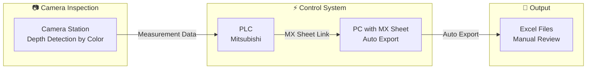

**⚠️ Problem**: Data was trapped in Excel files with no centralized database, no real-time monitoring, and manual report generation.

#### The Challenge

Stakeholders identified several limitations with the original setup:

| Problem | Impact |
|---------|--------|
| Data trapped in Excel files | Cannot easily analyze trends over time |
| No real-time monitoring | QC team cannot see issues immediately |
| Manual comparison with CMM | Time-consuming correlation analysis |
| No historical database | Cannot trace quality issues back to source |
| Report generation manual | Weekly/monthly reports take hours to create |

**Stakeholder Requirement**: Transform this into a **fully digital system** that can:
- Automatically collect and store all inspection data
- Compare camera inspection results with CMM measurements
- Provide real-time SPC charts for shopfloor monitoring
- Enable data analysis to identify quality issues and adjust production

#### My Approach

When I started this project, I faced constraints:
- **No PLC expertise**: I didn't have knowledge about the PLC programming or MX Sheet configuration
- **Cannot modify existing setup**: Stakeholders wanted to keep the proven PLC → MX Sheet → Excel workflow unchanged
- **Must work with what exists**: The Excel output format was fixed

**Solution Strategy**: Instead of changing the upstream system, I built a **downstream data collection layer**:

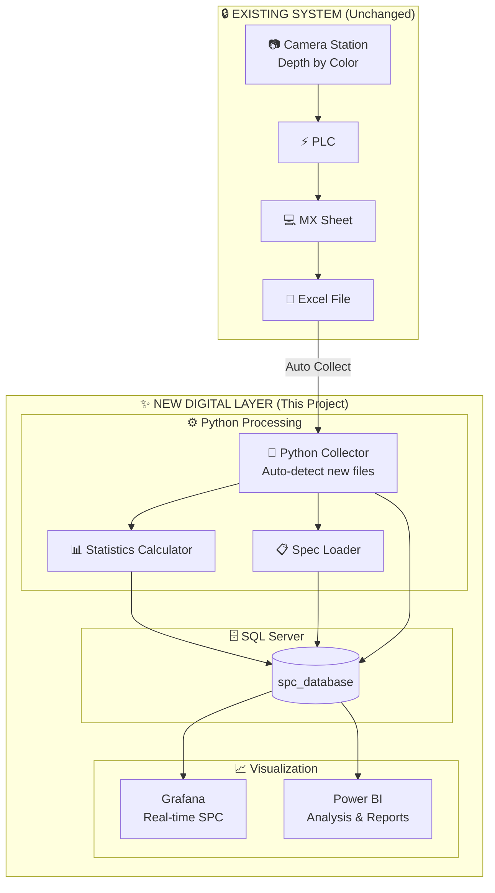

### What This System Does

* Collects inspection data from Camera Inspection Excel files in real-time
* Extracts GD&T (Geometric Dimensioning & Tolerancing) measurements
* Extracts XYZ coordinate measurements
* Calculates PPK (Process Performance Index) and PP values
* Calculates UCL (Upper Control Limit) and LCL (Lower Control Limit)
* Determines quality status (OK/NG) by comparing values against specification limits
* Stores all data in SQL Server database
* Generates Excel summary reports by shift
* Displays real-time SPC charts on Grafana
* Provides data for Power BI reports and CMM correlation analysis (v2.0)

### Who Uses This System

| User | Purpose |
|------|---------|
| QC Team | Monitor real-time SPC at shopfloor |
| Engineering | Analyze issues, compare with CMM, improve process |
| Management | Review weekly/monthly quality reports |

### Key Numbers

| Item | Value |
|------|-------|
| GD&T measurement points | Up to 372 per side (LH/RH), varies by line |
| XYZ measurement points | Up to 579 per side (LH/RH), varies by line |
| Samples for PPK calculation | Last 125 items (rolling window) |
| SQL tables | 13 total (6 Camera + 6 CMM mirrored + Specs share schema) |
| Production lines supported | 4 (Line_01, Line_02, Line_03, Line_R) |

---

## 2. Version History

### v2.0 — Camera vs CMM Correlation Release (2026-04)

v2.0 closes the loop on the original stakeholder requirement: validating
camera measurements against CMM. v1.0 delivered centralization and real-time
monitoring; v2.0 brings CMM data into the same database and builds the
analytical layer to compare the two.

**Major additions:**
- 🆕 **CMM data integration** via Microsoft Power Platform
  (Power App → Power Automate → SQL Gateway → on-prem SQL)
- 🆕 **CMM table set** (`cmm_header`, `cmm_gdt`, `cmm_xyz`, `cmm_specs`,
  `cmm_gdt_stats`, `cmm_xyz_stats`) — same structure as Camera tables,
  separate storage for clean source separation
- 🆕 **CMM-to-Camera point mapping** column in `cmm_specs` — bridges the two
  measurement systems for correlation queries
- 🆕 **GD&T-to-XYZ link column** in spec tables — maps each GD&T point to
  the XYZ points used to calculate it
- 🆕 **`xyz_axis` extended to spec tables** — `"X"`, `"Y"`, `"Z"` for XYZ
  points; `"None"` for GD&T points (calculated values, no single axis)
- 🆕 **4-page Power BI dashboard** for structured Camera vs CMM analysis
- 🆕 **Two new statistics tables** (`spc_gdt_stats`, `spc_xyz_stats`)
  with full lineage to source data (mirrored on CMM side)
- 🆕 **PPK capability classification**: Capable / Marginal / Not Capable
- 🆕 **Auto-reconnect logic** with 3-retry mechanism
- 🆕 **Statistics retry queue** — failed calculations retry at end-of-cycle
- 🆕 **Post-insert verification** across all tables
- 🆕 **PySpark JDBC** integration in spec loader (with pyodbc fallback)
- 🆕 **Line_R production line** support (different Excel layout)
- 🆕 One-sided spec handling for PPK (PPU-only or PPL-only)
- 🆕 `xyz_axis` as dedicated column on data tables (was suffix in `data_type`)

**Fixed:**
- PPK = NULL when one spec limit was zero
- Statistics lost on database connection drops mid-cycle
- Silent partial inserts when one table failed

### v1.0 — Initial Production Release (2025-12)

- Excel-to-SQL ETL pipeline for camera inspection data
- 5 universal tables (header, GDT, XYZ, PPK/PP, Specs)
- PPK/PP/UCL/LCL calculation engine
- Two-phase insert (raw + SPC snapshot)
- Spec loading with Excel cache
- Grafana real-time SPC integration
- Power BI weekly/monthly reports
- Multi-line support (Line_01, Line_02)

### Project Evolution Phases

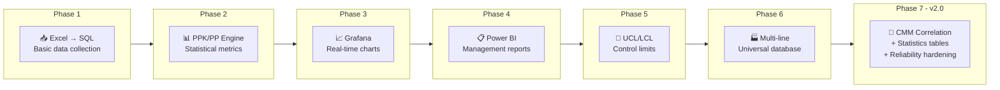

| Phase | What I Built | Outcome |
|-------|--------------|---------|
| **Phase 1** | Python script to read Excel → Insert to SQL | Data centralized in database |
| **Phase 2** | Added PPK/PP calculation engine | Statistical process control metrics |
| **Phase 3** | Connected Grafana for visualization | Real-time SPC charts at shopfloor |
| **Phase 4** | Built Power BI reports | Weekly/monthly analysis for management |
| **Phase 5** | Added UCL/LCL calculation | Control limits for process monitoring |
| **Phase 6** | Multi-line support | Universal database for all production lines |
| **Phase 7 (v2.0)** | CMM integration + statistics tables + reliability | Closed the loop on camera vs CMM correlation |

#### Why Camera Inspection Data Matters

The camera inspection system is unique:

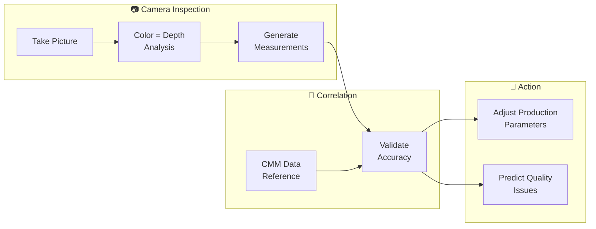

- **Depth Detection by Color**: Cameras capture surface images where color variations indicate depth differences
- **Non-contact Measurement**: Unlike CMM probes, cameras measure without touching the part
- **High Speed**: Can inspect many points simultaneously
- **Correlation with CMM**: Data must be comparable to CMM results for validation

By digitizing both data sources (v2.0), we can:
- **Compare camera vs CMM results** statistically (correlation + gap analysis)
- **Identify systematic errors** in camera measurements
- **Adjust production parameters** based on trend analysis
- **Reduce CMM bottleneck** by trusting camera on well-correlated points
- **Detect calibration drift** when camera-CMM correlation breaks down

---

## 3. System Architecture

### System Flow Diagram (v2.0)

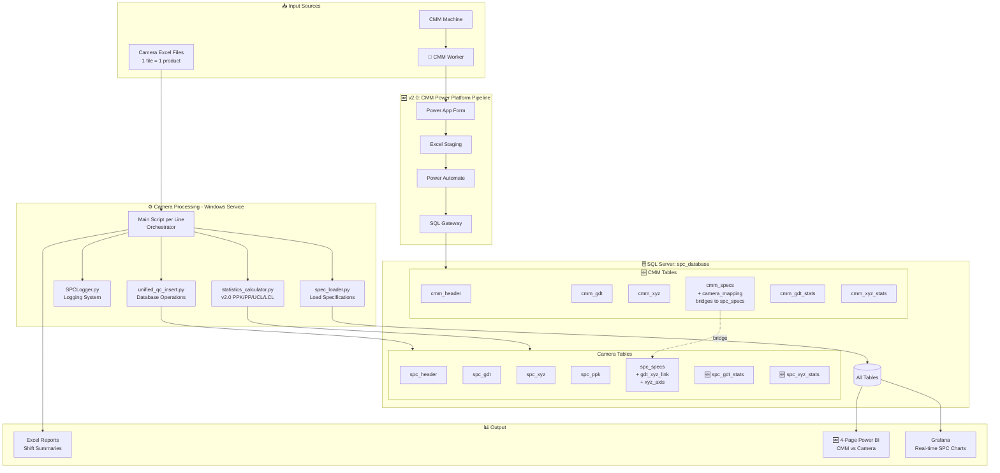

### How It Works

The system runs as a **Windows Service** on a PC at the shopfloor. It automatically:

1. **Scans** for new Excel files from Insepction Camera machine output folder
2. **Reads** GD&T data and XYZ data
3. **Loads** specification limits from SQL (with Excel caching for speed)
4. **Checks** quality status (OK/NG) for each measurement
5. **Calculates** PPK, PP, UCL, LCL using last 125 samples (rolling window)
6. **Inserts** all data to SQL database
7. **Verifies** all 7 tables received data correctly (v2.0)
8. **Generates** shift summary Excel reports
9. **Logs** all activities to console and Excel

In parallel (v2.0), the **CMM data pipeline** runs on Microsoft Power Platform:

1. **Worker submits** CMM inspection results via Power App
2. **Excel staging** holds the submission
3. **Power Automate** extracts and transforms the data
4. **SQL Gateway** writes to the same on-prem database
5. **Power BI** reads from SQL for the 4-page correlation dashboard

### Insert Strategy (v2.0)

| Step | What Gets Inserted | When |
|------|-------------------|------|
| 1 | Headers + Raw measurements (GDT, XYZ) | Per file |
| 2 | Statistics (PPK, PP, UCL, LCL with lineage) | Per run, immediately after raw insert |
| 3 | Verification check across all tables | After step 2 |

If statistics fail mid-cycle, the run is added to a **retry queue** and
re-attempted at the end of the scan cycle (v2.0 reliability feature).

---

## 4. Database Design

### Database Schema (v2.0)

The schema has **two parallel table sets** in the same database:
- **Camera tables** (real-time, every product) — prefix: `spc_*`
- **CMM tables** (sampled, irregular timing) — prefix: `cmm_*`

The CMM tables mirror the Camera tables in structure. The bridge between
the two is the `camera_mapping` column on `cmm_specs`, which maps each
CMM measurement code to its Camera equivalent for correlation analysis.

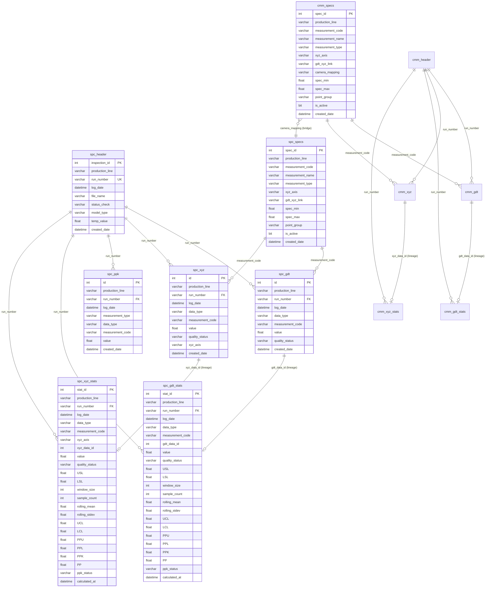

### Camera Table Set

| Table | Purpose | Version |
|-------|---------|---------|
| `spc_header` | File metadata, status | v1.0 |
| `spc_gdt` | GD&T measurements + UCL/LCL | v1.0 |
| `spc_xyz` | XYZ coordinates + UCL/LCL | v1.0 |
| `spc_ppk` | PPK/PP calculation results (legacy) | v1.0 |
| `spc_specs` | Camera specification limits + mapping metadata | v1.0 (extended in v2.0) |
| 🆕 `spc_gdt_stats` | GDT stats with full lineage to source row | v2.0 |
| 🆕 `spc_xyz_stats` | XYZ stats with full lineage to source row | v2.0 |

### CMM Table Set 🆕 v2.0

The CMM tables mirror the Camera structure exactly — same columns, same
relationships, same statistics design. This separation keeps the two
data sources cleanly isolated while allowing correlation through
`cmm_specs.camera_mapping`.

| Table | Purpose | Mirrors |
|-------|---------|---------|
| 🆕 `cmm_header` | CMM submission metadata | `spc_header` |
| 🆕 `cmm_gdt` | CMM GD&T measurements | `spc_gdt` |
| 🆕 `cmm_xyz` | CMM XYZ measurements | `spc_xyz` |
| 🆕 `cmm_specs` | CMM specification limits + camera mapping | `spc_specs` + extra `camera_mapping` |
| 🆕 `cmm_gdt_stats` | CMM GDT stats with lineage | `spc_gdt_stats` |
| 🆕 `cmm_xyz_stats` | CMM XYZ stats with lineage | `spc_xyz_stats` |

**Why mirror instead of merge?**

A merged design (one set of tables with a `data_source` discriminator) was
considered but rejected because:

- CMM and Camera have **different volumes** (every product vs random sample)
  — a single fact table would skew toward Camera data
- CMM has **more measurement points** (extra accuracy points the camera
  doesn't measure) — would force `NULL`s in shared rows
- CMM ingestion path is **completely different** (Power Platform vs
  Python file watcher) — separate tables make ownership clearer
- Failure isolation — a CMM ingestion bug can't corrupt camera rows

The mirror design keeps both sources clean and correlation explicit
through the spec mapping.

### Spec Tables — The Bridge Layer

Both `spc_specs` and `cmm_specs` are **reference/dimension tables** that
hold the metadata describing each measurement point. The v2.0 spec design
adds three important columns:

| Column | Purpose | On `spc_specs` | On `cmm_specs` |
|--------|---------|:--------------:|:--------------:|
| `xyz_axis` | "X", "Y", "Z" for XYZ points; **"None" for GD&T points** | ✅ | ✅ |
| `gdt_xyz_link` | Links GD&T points to the XYZ points used to calculate them | ✅ | ✅ |
| `camera_mapping` | Maps CMM measurement_code → equivalent Camera measurement_code | ❌ | ✅ |

#### `xyz_axis` on Specs

GD&T values are calculated from underlying XYZ measurements. To separate
analysis cleanly:

| `measurement_type` | `xyz_axis` value |
|--------------------|------------------|
| XYZ | `"X"`, `"Y"`, or `"Z"` (the actual axis) |
| GDT | `"None"` (no single axis — calculated from multiple) |

This lets queries like *"show me all X-axis measurements"* run directly
against the spec table without parsing measurement codes.

#### `gdt_xyz_link` — GD&T to XYZ Traceability

Each GD&T point is calculated from a specific set of XYZ points. The
`gdt_xyz_link` column stores this relationship so the system can answer:

- *"Which XYZ points feed into this GD&T calculation?"*
- *"If GD&T value drifts, which underlying XYZ point is causing it?"*

This is critical for **Page 2 of the Power BI dashboard** (drill-down
view), where a poor GD&T PPK is decomposed into its component XYZ
measurements and overlaid with temperature.

The same column exists on both spec tables because:
- Camera GD&T points calculate from Camera XYZ points
- CMM GD&T points calculate from CMM XYZ points
- The relationship structure is identical, just the underlying data differs

#### `camera_mapping` — The Correlation Bridge 🆕

This column exists **only on `cmm_specs`**, not on `spc_specs` (Camera is
the reference; CMM points map to Camera, not vice versa).

Each CMM point's `camera_mapping` value is the `measurement_code` of the
equivalent Camera point.

| `cmm_specs.measurement_code` | `cmm_specs.camera_mapping` | Meaning |
|------------------------------|-----------------------------|---------|
| `CMM_BRKT_3633_A` | `Line_R_BRKT_BMPR_3633` | Same physical point, both systems measure it |
| `CMM_REF_PIN_X` | `Line_R_PIN_REF_001` | Same physical point with different naming |
| `CMM_ACCURACY_07` | `NULL` | CMM-only accuracy point — no camera equivalent |

**How correlation joins work:**

```sql
-- Pages 3 & 4 correlation query pattern
SELECT
    cs.measurement_code AS cmm_code,
    cs.camera_mapping AS camera_code,
    cd.value AS cmm_value,
    sd.value AS camera_value
FROM cmm_specs cs
JOIN cmm_gdt cd
    ON cd.measurement_code = cs.measurement_code
JOIN spc_gdt sd
    ON sd.measurement_code = cs.camera_mapping
WHERE cs.camera_mapping IS NOT NULL
  AND cs.production_line = 'Line_R'
```

CMM-only points (where `camera_mapping IS NULL`) are excluded from
correlation pages but still appear on Pages 1 and 2 for standalone
analysis.

### Why Two Statistics Tables (v2.0)?

The v1.0 `spc_ppk` table stored PPK/PP as flat values without
lineage — you couldn't trace which source measurements produced any PPK.

The v2.0 statistics tables fix this:
- **Foreign key** to source data row (`gdt_data_id` / `xyz_data_id`)
- **Window context** stored (`window_size`, `sample_count`)
- **Full SPC snapshot** (rolling_mean, rolling_stdev, UCL, LCL, PPU, PPL, PPK, PP)
- **Capability classification** (`ppk_status`: Capable / Marginal / Not Capable)
- **Audit trail** (`calculated_at` timestamp)

You can answer: *"Which 125 samples produced this PPK value, and when was it calculated?"*

### Data Types in Tables

**spc_gdt.data_type:**

| Value | Description |
|-------|-------------|
| LH | Left-hand measurement value |
| RH | Right-hand measurement value |
| LH UCL | Left-hand Upper Control Limit |
| LH LCL | Left-hand Lower Control Limit |
| RH UCL | Right-hand Upper Control Limit |
| RH LCL | Right-hand Lower Control Limit |

**spc_xyz.data_type:**

| Value | Description |
|-------|-------------|
| LH | Left-hand measurement (xyz_axis = X, Y, or Z) |
| RH | Right-hand measurement (xyz_axis = X, Y, or Z) |
| LH UCL | Left-hand Upper Control Limit |
| LH LCL | Left-hand Lower Control Limit |
| RH UCL | Right-hand Upper Control Limit |
| RH LCL | Right-hand Lower Control Limit |

**spc_xyz.xyz_axis** (v2.0 dedicated column, was suffix in v1.0):

| Value | Description |
|-------|-------------|
| X | X-axis coordinate |
| Y | Y-axis coordinate |
| Z | Z-axis coordinate |
| N | Nominal/other (no axis suffix in code) |

**spc_gdt_stats.ppk_status / spc_xyz_stats.ppk_status (v2.0):**

| Value | Meaning | Threshold |
|-------|---------|-----------|
| Capable | Process is performing well | PPK ≥ 1.33 |
| Marginal | Process is borderline | 1.00 ≤ PPK < 1.33 |
| Not Capable | Process needs attention | PPK < 1.00 |
| *(suffix)* `(Low Sample)` | Sample count below 125 | n < 125 |

### Quality Status Logic

For each measurement value, the system checks against specification limits:

```
IF spec_min <= value <= spec_max THEN status = "OK"
IF value < spec_min OR value > spec_max THEN status = "NG"
IF spec_min = 0 AND spec_max = 0 THEN status = "N/A" (no spec defined)
```

### Why Universal Design?

- ✅ One set of Camera tables for ALL lines (separated by `production_line`)
- ✅ One set of CMM tables for ALL lines (same pattern)
- ✅ Easy to compare data across lines
- ✅ Add new line = just insert with new `production_line` value
- ✅ No need to create new tables for new line
- ✅ Grafana/Power BI queries work automatically
- ✅ CMM and Camera correlation is explicit through `cmm_specs.camera_mapping`
  rather than hidden in shared rows

### Data Volumes

Estimated data growth per day (assuming 100 Camera inspections/day +
4 CMM submissions/shift = 8/day):

**Camera tables:**

| Table | Rows/Inspection | Rows/Day | Rows/Month |
|-------|-----------------|----------|------------|
| spc_header | 2 | 200 | 6,000 |
| spc_gdt | ~2,976 | ~297,600 | ~8,928,000 |
| spc_xyz | ~4,632 | ~463,200 | ~13,896,000 |
| spc_ppk | ~3,804 | ~380,400 | ~11,412,000 |
| 🆕 spc_gdt_stats | ~744 | ~74,400 | ~2,232,000 |
| 🆕 spc_xyz_stats | ~1,158 | ~115,800 | ~3,474,000 |
| **Camera Total** | **~13,316** | **~1,331,600** | **~39,948,000** |

**CMM tables (much lower volume due to sample-based inspection):**

| Table | Rows/Submission | Rows/Day | Rows/Month |
|-------|-----------------|----------|------------|
| 🆕 cmm_header | 2 | 16 | 480 |
| 🆕 cmm_gdt | ~3,500 | ~28,000 | ~840,000 |
| 🆕 cmm_xyz | ~5,500 | ~44,000 | ~1,320,000 |
| 🆕 cmm_gdt_stats | ~875 | ~7,000 | ~210,000 |
| 🆕 cmm_xyz_stats | ~1,375 | ~11,000 | ~330,000 |
| **CMM Total** | **~11,252** | **~90,016** | **~2,700,480** |

**Note:** Camera tables grow ~600MB-1.2GB per month per line. CMM tables
grow much slower (~50-100MB per month per line) due to sample-based
inspection. Plan disk space accordingly.

---

## 5. Data Flow

### Camera Data Flow (v1.0 + v2.0)

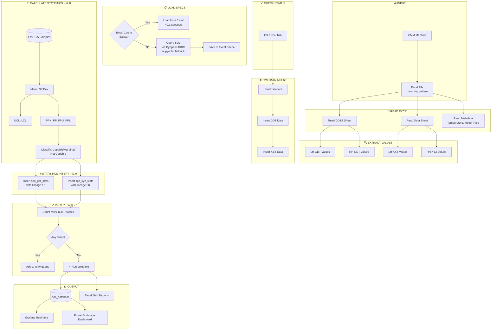

### CMM Data Flow (v2.0 — NEW)

CMM inspection has different characteristics than camera inspection:

| Aspect | Camera | CMM |
|--------|--------|-----|
| Volume | Every product | Sample (3-4 per shift per model) |
| Schedule | Continuous | Irregular (when worker finishes) |
| Method | Automated | Human + machine |
| Points | Baseline set | Baseline + extra accuracy points |
| Data entry | Automated Excel | Worker submission |

A traditional file-watcher doesn't work for CMM because submissions are
irregular and there's no fixed file. The v2.0 solution uses Microsoft
Power Platform:

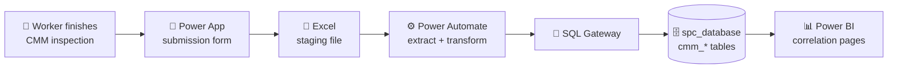

**Why this design works:**

| Requirement | Solution |
|-------------|----------|
| Workers need a form, not SQL access | Power App mobile/tablet form |
| No fixed schedule | Power Automate trigger-based, not timer-based |
| Same database as camera (for joining) | SQL Gateway bridges cloud → on-prem SQL |
| Clean source separation | CMM lands in `cmm_*` tables (mirror of `spc_*` tables) |
| Correlation requires bridge | `cmm_specs.camera_mapping` column maps CMM points to Camera points |

**Scope note:** I designed this pipeline up to the SQL staging layer.
A separate team handles the final ingestion handoff. The Power BI
dashboard layer (Section 11) is mine end-to-end.

### Step-by-Step Camera Process

| Step | Component | Description |
|------|-----------|-------------|
| 1 | CMM/Camera Machine | Outputs Excel file with measurement data |
| 2 | Main script | Scans folder for new files (every 10 seconds) |
| 3 | Filename Filter | Validates pattern for that production line |
| 4 | Duplicate Check | Checks local log + SQL database |
| 5 | Read Excel | Extracts GD&T and XYZ values |
| 6 | Load Specs | From Excel cache (PySpark JDBC or pyodbc fallback to SQL) |
| 7 | Check Status | Compare each value against spec limits |
| 8 | Raw Insert | Headers + raw measurements |
| 9 | Calculate Stats (v2.0) | PPK, PP, UCL, LCL from last 125 samples |
| 10 | Stats Insert (v2.0) | Insert to spc_gdt_stats + spc_xyz_stats with lineage |
| 11 | Verification (v2.0) | Count rows in all 7 tables; queue retry on failure |
| 12 | Save Excel | Shift summary reports |
| 13 | Log | Record to console and Excel log |

---

## 6. Code Structure

### File Overview

```
Project/
├── MainSPC_Line_01.py               # Main script for Line_01
├── MainSPC_Line_02.py               # Main script for Line_02
├── MainSPC_Line_03.py               # Main script for Line_03
├── MainSPC_Line_R.py                # Main script for Line_R (v2.0, different layout)
├── unified_qc_insert.py             # Database insert operations
├── statistics_calculator.py         # 🆕 v2.0 PPK/PP calculation engine (replaces unified_ppk_calculator.py)
├── spec_loader.py                   # Spec loading with PySpark JDBC option (v2.0)
├── SPCLogger.py                     # Logging system
├── header_definitions.py            # Measurement code headers
├── .env                             # Environment configuration
└── {Line}_Log/                      # Output folder per line (auto-created)
    ├── Logs/                        # Activity logs
    ├── Output/                      # Shift summary Excel files
    └── Specs/                       # Cached specification Excel
```

### Component Details

#### Main Script per Line — Orchestrator

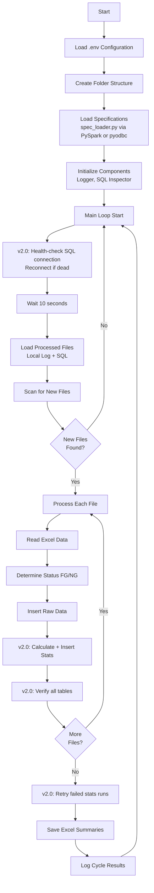

**Key Configuration (DATA_MAP) — example for Line_R:**

| Setting | Value | Description |
|---------|-------|-------------|
| gdt_sheet | "GD&T Data" | Sheet name for GD&T |
| gdt_cols | "E,I,U" | Column E=codes, I=LH, U=RH |
| gdt_skiprows | 23 | Start row |
| gdt_nrows | 275 | Number of GDT rows |
| data_sheet | "Data" | Sheet name for XYZ |
| data_cols | "I,U" | Column I=LH, U=RH |
| data_skiprows | 14 | Start row |
| data_nrows | 470 | Number of XYZ rows |
| meta_sheet | "A" | Metadata sheet |
| temp_cell | "H7" | Temperature cell |
| model_cell | "G2" | Model type cell |

Each line has its own DATA_MAP because Excel layouts vary by camera setup.

---

#### unified_qc_insert.py — Database Operations

**Key Features:**
- Duplicate detection before insert (checks SQL + local log)
- Status check using measurement_code lookup
- Batch insert with `executemany` for performance
- Separate `xyz_axis` column for XYZ data (v2.0)

**Main Methods:**

| Method | Description |
|--------|-------------|
| `insert_headers_batch()` | Insert to spc_header |
| `insert_gdt_batch()` | Insert GDT measurements + UCL/LCL |
| `insert_xyz_batch()` | Insert XYZ measurements (with xyz_axis) |
| `insert_xyz_ucl_lcl_batch()` | Insert XYZ control limits |
| `insert_ppk_batch()` | Insert PPK/PP values (legacy v1 path) |
| `get_gdt_status()` | Check status using spec lookup |
| `get_xyz_status()` | Check status using spec lookup |
| `get_processed_filenames()` | Get already processed files from SQL |

**xyz_axis change (v1 → v2):**

v1.0:
```
data_type = "LH X", "LH Y", "LH Z", "RH X", etc.
```

v2.0:
```
data_type = "LH" or "RH"
xyz_axis = "X", "Y", "Z", or "N" (separate column)
```

This makes it easier to query "all LH data regardless of axis" without
parsing the string.

---

#### statistics_calculator.py — v2.0 PPK Calculation

**Replaces:** `unified_ppk_calculator.py` from v1.0

**Calculation Flow:**

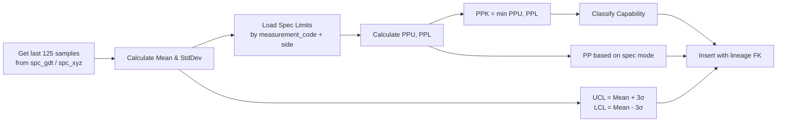

**Formulas:**

| Value | Formula |
|-------|---------|
| UCL | Mean + 3 × StdDev |
| LCL | Mean - 3 × StdDev |
| PPU | (USL - Mean) / (3 × StdDev) |
| PPL | (Mean - LSL) / (3 × StdDev) |
| PPK (two-sided) | min(PPU, PPL) |
| PPK (one-sided) | PPU only or PPL only (v2.0 fix) |
| PP (two-sided) | (USL - LSL) / (6 × StdDev) |
| PP (one-sided) | PPU or PPL (v2.0 fix) |

**One-sided spec handling (v2.0 fix):**

In v1.0, PPK was NULL whenever one spec limit was zero (e.g., flatness
specs where spec_min = 0 is valid). v2.0 correctly treats:
- `spec_min = NULL, spec_max != NULL` → one-sided upper, PPK = PPU
- `spec_min != NULL, spec_max = NULL` → one-sided lower, PPK = PPL
- `spec_min = 0, spec_max = 0` → no spec defined, skip
- `spec_min = 0, spec_max != 0` → valid one-sided lower (zero is a real limit)

**Capability classification (v2.0):**

| PPK Value | Classification |
|-----------|----------------|
| ≥ 1.33 | Capable |
| 1.00 - 1.33 | Marginal |
| < 1.00 | Not Capable |
| Sample count < 125 | Append "(Low Sample)" suffix |

**Per-run insert with lineage:**

Statistics are inserted **per run**, with `gdt_data_id` / `xyz_data_id`
foreign keys back to the source measurement row. This means:
- You can audit exactly which 125 samples produced any PPK value
- Statistics are tied 1:1 to the latest measurement for that code
- Old statistics aren't overwritten — every run gets a snapshot

---

#### spec_loader.py — v2.0 Dual-Path Loading

**Caching Strategy:**

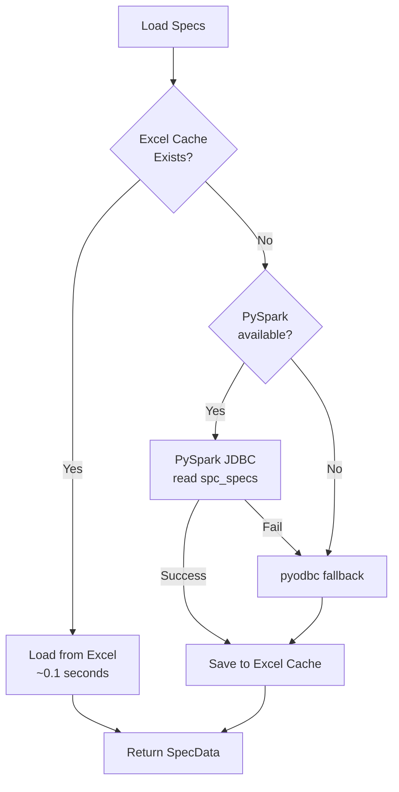

**Why caching?**
- SQL query: ~1-2 seconds
- Excel load: ~0.1 seconds
- Faster startup after first run

**Why PySpark JDBC option (v2.0)?**
- Spec loading is a bulk read (potentially thousands of rows)
- PySpark JDBC handles bulk reads more efficiently than pyodbc
- Includes automatic fallback to pyodbc if PySpark unavailable
- This is an optional optimization — the system works fine with pyodbc only

**Refresh Specs:**
To reload specs from SQL after database changes:
1. Delete Excel cache file: `Specs/Specs_Line_01.xlsx`
2. Restart the program
3. System reloads from SQL and creates new cache

**SpecData Object:**

```python
@dataclass
class SpecData:
    gdt_headers: List[str]
    xyz_headers: List[str]
    gdt_specs_lh: Dict[str, Tuple[float, float]]
    gdt_specs_rh: Dict[str, Tuple[float, float]]
    xyz_specs_lh: Dict[str, Tuple[float, float]]
    xyz_specs_rh: Dict[str, Tuple[float, float]]
    # Arrays for backward compatibility
    lh_max, lh_min, rh_max, rh_min: List[float]
    xyz_lh_max, xyz_lh_min, xyz_rh_max, xyz_rh_min: List[float]
```

---

## 7. Key Features

### Feature 1: Duplicate Detection

The system prevents duplicate processing by checking:

1. **Local Excel Log** — `processed_files_log.xlsx`
2. **SQL Database** — `spc_header.file_name`

Files are not reprocessed even if multiple instances run on different PCs.

### Feature 2: Spec-Based Status Check

Status is determined by comparing against **specification limits**:

```python
# Check each measurement against its spec
for code, value in zip(headers, values):
    status = sql_inspector.get_gdt_status(code, value, 'LH')
    if status == 'NG':
        final_status = 'NG'
        break
```

- **FG (Finish Good):** All points OK or N/A
- **NG (No Good):** Any point is NG

### Feature 3: Skip Zero / Skip Missing

Zero or missing values are skipped during insert to reduce database size.
Useful because many measurement points may have no data and would otherwise
fill the database with noise.

### Feature 4: Auto Folder Creation

The system automatically creates required folders per line:

```
{source_directory}/
└── {Line}_Log/
    ├── Logs/
    ├── Output/
    └── Specs/
```

### Feature 5: Shift-Based Reports

Excel summaries are generated per shift:

```
Summary Quality Line_01 Daily 23-12-2025-DayShift.xlsx
Summary Quality Line_01 Daily 23-12-2025-NightShift.xlsx
```

**Shift Definition:**
- Day Shift: 07:00 - 19:30
- Night Shift: 19:30 - 07:00

### Feature 6: ODBC Driver Auto-Detection

System automatically detects available ODBC driver:

```python
drivers = [
    "ODBC Driver 18 for SQL Server",
    "ODBC Driver 17 for SQL Server",
    "SQL Server Native Client 11.0",
    "SQL Server"
]
```

No manual driver configuration needed.

### Feature 7: Auto-Reconnect Logic 🆕 v2.0

Database connection automatically recovers on failure:

- Health-check via `SELECT 1` before each cycle
- Up to **3 retry attempts** with 10-second delay
- Fully closes dead connection before reconnecting
- Logs each attempt for debugging
- If all retries fail, waits 60 seconds before next cycle attempt

This prevents the service from dying when SQL Server has brief outages.

### Feature 8: Statistics Retry Queue 🆕 v2.0

If statistics calculation fails for a run mid-cycle:
- The run is added to `stats_failed_runs[]` queue
- At end of cycle, all queued runs are retried
- Statistics aren't lost just because of a transient connection issue

### Feature 9: Post-Insert Verification 🆕 v2.0

After each run insert, the system counts rows in all 7 tables:

```
[VERIFY] spc_header: 2 rows [OK]
[VERIFY] spc_gdt: 744 rows [OK]
[VERIFY] spc_xyz: 1158 rows [OK]
[VERIFY] spc_gdt_stats: 372 rows [OK]
[VERIFY] spc_xyz_stats: 579 rows [OK]
[VERIFY] All tables OK for Line_01-23042026-...
```

If any table shows zero rows, it's flagged as MISSING. This catches silent
partial failures that v1.0 couldn't detect.

### Feature 10: PySpark JDBC Spec Loading 🆕 v2.0

Spec loader tries PySpark first, falls back to pyodbc automatically.
Useful for bulk spec reads on lines with thousands of measurement points.

### Feature 11: PPK Capability Classification 🆕 v2.0

Every PPK value is classified as Capable / Marginal / Not Capable, with
a "(Low Sample)" suffix when the rolling window has fewer than 125 samples.
This makes Power BI dashboards instantly readable without DAX threshold logic.

---

## 8. Installation

### Requirements

| Item | Requirement |
|------|-------------|
| Operating System | Windows 10/11 or Windows Server |
| Python | 3.8 or higher |
| Database | SQL Server 2016+ |
| ODBC Driver | ODBC Driver 17 or 18 for SQL Server |
| PySpark (optional, v2.0) | 3.x with `mssql-jdbc` driver |
| Network | Access to SQL Server and CMM output folder |

### Python Dependencies

```
pandas>=1.3.0
numpy>=1.21.0
pyodbc>=4.0.30
sqlalchemy>=1.4.0
openpyxl>=3.0.9
python-dotenv>=0.19.0
pyspark>=3.0.0  # optional, v2.0
```

### Installation Steps

#### Step 1: Install Python

Download and install Python 3.8+ from [python.org](https://www.python.org/downloads/)

During installation, check:
- ☑️ Add Python to PATH
- ☑️ Install pip

#### Step 2: Install ODBC Driver

Download and install from Microsoft:
- [ODBC Driver 18 for SQL Server](https://docs.microsoft.com/en-us/sql/connect/odbc/download-odbc-driver-for-sql-server)

#### Step 3: Install Python Packages

```bash
pip install pandas numpy pyodbc sqlalchemy openpyxl python-dotenv

# Optional v2.0:
pip install pyspark
```

#### Step 4: Install Microsoft SQL Server JDBC Driver (v2.0, optional)

For PySpark JDBC option, place `mssql-jdbc-*.jar` in your Spark classpath.
Download from: [Microsoft JDBC Driver for SQL Server](https://learn.microsoft.com/en-us/sql/connect/jdbc/download-microsoft-jdbc-driver-for-sql-server)

#### Step 5: Copy Program Files

Copy all Python files to target folder:
```
C:\SPC_System\
├── MainSPC_Line_01.py
├── unified_qc_insert.py
├── statistics_calculator.py
├── spec_loader.py
├── SPCLogger.py
├── header_definitions.py
├── .env
```

#### Step 6: Configure Environment

Edit `.env` file with your settings (see Configuration section).

#### Step 7: Test Run

```bash
cd C:\SPC_System
python MainSPC_Line_01.py
```

Check console output for errors.

### Windows Service Installation (Optional)

To run as Windows Service that starts automatically:

#### Using NSSM (Non-Sucking Service Manager)

1. Download NSSM from [nssm.cc](https://nssm.cc/download)

2. Install service:
```bash
nssm install SPC_Line_01 "C:\Python310\python.exe" "C:\SPC_System\MainSPC_Line_01.py"
```

3. Configure service:
```bash
nssm set SPC_Line_01 AppDirectory "C:\SPC_System"
nssm set SPC_Line_01 DisplayName "SPC Quality System - Line_01"
nssm set SPC_Line_01 Description "Real-time SPC monitoring for Line_01"
nssm set SPC_Line_01 Start SERVICE_AUTO_START
```

4. Start service:
```bash
nssm start SPC_Line_01
```

#### Service Management

| Action | Command |
|--------|---------|
| Start | `nssm start SPC_Line_01` |
| Stop | `nssm stop SPC_Line_01` |
| Restart | `nssm restart SPC_Line_01` |
| Status | `nssm status SPC_Line_01` |
| Remove | `nssm remove SPC_Line_01` |

---

## 9. Configuration

### Environment File (.env)

All configuration is in `.env` file. Create this file in the same folder as the Python scripts.

```ini
# ============================================
# SPC SYSTEM CONFIGURATION
# ============================================

# --------------------------------------------
# DATABASE CONNECTION
# --------------------------------------------
DB_SERVER=xxx.xxx.xxx.xxx
DB_NAME_SPC=spc_database
DB_USER=your_username
DB_PASS=your_password

# --------------------------------------------
# SOURCE DIRECTORIES (CMM/Camera Output Folders)
# --------------------------------------------
Line_01_DIRECTORY=D:\Data\Line_01_LOG
Line_02_DIRECTORY=D:\Data\Line_02_LOG
Line_03_DIRECTORY=D:\Data\Line_03_LOG
Line_R_DIRECTORY=D:\Data\Line_R_LOG

# --------------------------------------------
# PROCESSING SETTINGS
# --------------------------------------------
COUNTDOWN_SECONDS=10
LOOKBACK_DAYS=30
```

### Configuration Details

#### Database Settings

| Variable | Description | Example |
|----------|-------------|---------|
| `DB_SERVER` | SQL Server IP or hostname | 192.168.1.100 |
| `DB_NAME_SPC` | Database name | spc_database |
| `DB_USER` | Database username | spc_user |
| `DB_PASS` | Database password | (your password) |

#### Directory Settings

| Variable | Description | Example |
|----------|-------------|---------|
| `Line_01_DIRECTORY` | Camera output folder for Line_01 | D:\Camera\Line_01 |
| `Line_02_DIRECTORY` | Camera output folder for Line_02 | D:\Camera\Line_02 |
| `Line_03_DIRECTORY` | Camera output folder for Line_03 | D:\Camera\Line_03 |
| `Line_R_DIRECTORY` | Camera output folder for Line_R | D:\Camera\Line_R |

**Note:** Supports Windows environment variables like `%USERPROFILE%`

#### Processing Settings

| Variable | Description | Default |
|----------|-------------|---------|
| `COUNTDOWN_SECONDS` | Seconds between scan cycles | 10 |
| `LOOKBACK_DAYS` | Days to check for duplicates in SQL | 30 |

### Folder Structure (Auto-Created)

The system automatically creates this folder structure per line:

```
{Line_xx_DIRECTORY}/
├── (Camera Excel files - source)
└── Line_xx_Log/
    ├── Logs/
    │   ├── SPC_Log_Line_xx_2025-12-23.xlsx    # Daily activity log
    │   └── processed_files_log.xlsx           # List of processed files
    ├── Output/
    │   └── Summary Quality Line_xx Daily {date}-{shift}.xlsx
    └── Specs/
        └── Specs_Line_xx.xlsx                 # Cached specifications
```

### File Naming Patterns

Each line has its own filename pattern. Files not matching the pattern are ignored.

Example for Line_R:
```
Line_R_GCP_LINE_*-5005-*-*-*.xlsx
```

---

## 10. Usage

### Automatic Operation

Once installed, the system runs automatically:

1. **Starts with Windows** — If installed as service
2. **Scans every 10 seconds** — Configurable via `COUNTDOWN_SECONDS`
3. **Processes new files** — Detects and processes automatically
4. **Reconnects on failure** — v2.0 auto-reconnect logic
5. **No manual action needed** — Fully automated

### Console Output (v2.0)

When running, you'll see output like:

```
============================================================
  FOLDER CONFIGURATION
============================================================
  Source Excel:     D:\Data\Line_R_LOG
  Log Root:         D:\Data\Line_R_LOG\Line_R_Log
  Activity Logs:    D:\Data\Line_R_LOG\Line_R_Log\Logs
  Shift Output:     D:\Data\Line_R_LOG\Line_R_Log\Output
  Specs Cache:      D:\Data\Line_R_LOG\Line_R_Log\Specs
============================================================

[INFO] Loading specs for Line_R...
[INFO] PySpark fetched 745 spec rows
[INFO] Loaded 275 GDT headers, 470 XYZ headers
[INFO] SQL Inspector ready for Line_R

==================================================
Next scan in..... 10 seconds
==================================================

[CYCLE] Starting scan cycle
[INFO] Found 50 valid files, checking for new ones...
[FILE] Processing: Line_R_GCP_LINE_ABCD-5005-...-001.xlsx
[INFO] Reading Excel file...
[INFO] Excel read completed (2.35s)
[SQL] Insert: headers=2, GDT=550, XYZ=940, Total=1492
[STATS] GDT=550, XYZ=940, PPK(GDT)=275, PPK(XYZ)=470
[VERIFY] spc_header: 2 rows [OK]
[VERIFY] spc_gdt: 550 rows [OK]
[VERIFY] spc_xyz: 940 rows [OK]
[VERIFY] spc_gdt_stats: 275 rows [OK]
[VERIFY] spc_xyz_stats: 470 rows [OK]
[VERIFY] All tables OK for Line_R-26042026-...
[FILE] Completed: Line_R_GCP_LINE_ABCD-5005-...-001.xlsx (5.2s)
[INFO] Saved 1 new records to Excel files
[CYCLE] Completed: 50 files found, 1 processed
```

### Manual Operations

| Task | How to Do |
|------|-----------|
| Check if running | Look at console output or Windows Services |
| View activity log | Open `{Line}_Log/Logs/SPC_Log_{Line}_YYYY-MM-DD.xlsx` |
| View processed files | Open `{Line}_Log/Logs/processed_files_log.xlsx` |
| Reprocess a file | Delete entry from `processed_files_log.xlsx` and restart |
| Refresh specs | Delete `{Line}_Log/Specs/Specs_{Line}.xlsx` and restart |
| Force immediate scan | Press Ctrl+C and restart the script |
| Stop processing | Press Ctrl+C or stop the Windows service |

### Output Files

Located in `{Line}_Log/Output/`:

| File Pattern | Content |
|--------------|---------|
| `Summary Quality {Line} Daily {date}-{shift}.xlsx` | Raw GD&T values |
| `Summary Quality {Line} Dimension Daily {date}-{shift}.xlsx` | XYZ values |

### Error Handling (v2.0)

The system handles errors gracefully:

1. **File read error** — Skips file, logs error, continues
2. **SQL connection lost** — Auto-reconnect, up to 3 retries with 10s delay
3. **Statistics fail mid-cycle** — Added to retry queue, retried at end of cycle
4. **Partial table inserts** — Detected by post-insert verification
5. **Invalid file format** — Skips file, logs warning
6. **Missing specs** — Logs warning, PPK = NULL for those points
7. **Fatal error** — Logs error, waits 10 seconds, restarts loop

All errors are logged to both console and Excel log file.

---

## 11. Visualization

### Grafana — Real-Time SPC Monitoring

Grafana displays real-time SPC charts at shopfloor for production monitoring.

#### Dashboard Features

| Feature | Description |
|---------|-------------|
| Real-time update | Data shows as soon as it's in database |
| Control charts | Shows value with UCL/LCL lines and spec limits |
| PPK trend | Shows PPK value over time |
| Status indicator | Green (OK) / Red (NG) based on limits |
| Line filter | Select which production line to view |
| Point filter | Select which measurement point to view |
| Date range | Filter by time period |

#### Grafana Variables Setup

Create these variables in your dashboard:

**Variable: `$line`**
```sql
SELECT DISTINCT production_line
FROM spc_header
ORDER BY production_line
```

**Variable: `$measurement_type`** (static): `GDT`, `XYZ`

**Variable: `$point` (depends on $line and $measurement_type)**
```sql
-- For GDT:
SELECT DISTINCT measurement_code
FROM spc_gdt
WHERE production_line = '$line'
ORDER BY measurement_code
```

**Variable: `$side`** (static): `LH`, `RH`

#### Grafana Query Examples

**1. GD&T Measurement with Control Limits**

```sql
SELECT log_date AS time, value, 'Value' AS metric
FROM spc_gdt
WHERE production_line = '$line'
  AND measurement_code = '$point'
  AND data_type = '$side'
  AND $__timeFilter(log_date)
UNION ALL
SELECT log_date, UCL, 'UCL'
FROM spc_gdt_stats
WHERE production_line = '$line'
  AND measurement_code = '$point'
  AND data_type = '$side'
  AND $__timeFilter(log_date)
UNION ALL
SELECT log_date, LCL, 'LCL'
FROM spc_gdt_stats
WHERE production_line = '$line'
  AND measurement_code = '$point'
  AND data_type = '$side'
  AND $__timeFilter(log_date)
ORDER BY time
```

**2. PPK Trend Chart (v2.0 — uses statistics table)**

```sql
SELECT log_date AS time, PPK
FROM spc_gdt_stats
WHERE production_line = '$line'
  AND measurement_code = '$point'
  AND data_type = '$side'
  AND $__timeFilter(log_date)
ORDER BY log_date
```

**3. Latest PPK Status Table (v2.0)**

```sql
SELECT
    measurement_code,
    PPK,
    ppk_status,
    sample_count
FROM spc_gdt_stats s
WHERE production_line = '$line'
  AND data_type = '$side'
  AND calculated_at = (
      SELECT MAX(calculated_at)
      FROM spc_gdt_stats
      WHERE production_line = '$line'
        AND measurement_code = s.measurement_code
        AND data_type = s.data_type
  )
ORDER BY PPK ASC
```

**4. NG Count by Point (Problem Points)**

```sql
SELECT measurement_code, COUNT(*) AS ng_count
FROM spc_gdt
WHERE production_line = '$line'
  AND quality_status = 'NG'
  AND data_type IN ('LH', 'RH')
  AND $__timeFilter(log_date)
GROUP BY measurement_code
ORDER BY ng_count DESC
```

#### Grafana Panel Recommendations

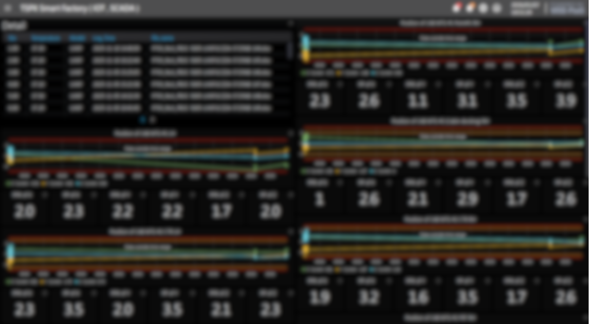

| Panel Type | Best For |
|------------|----------|
| Time series | Measurement values with UCL/LCL |
| Stat | Current PPK value |
| Gauge | PPK with thresholds |
| Table | Latest values for all points |
| Bar chart | NG count by measurement point |
| Pie chart | OK vs NG distribution |

#### PPK Thresholds for Visualization

| PPK Value | Status | Color |
|-----------|--------|-------|
| ≥ 1.33 | Capable | Green |
| 1.0 - 1.33 | Marginal | Yellow |
| < 1.0 | Not Capable | Red |

---

### Power BI — 4-Page Dashboard 🆕 v2.0

The v2.0 Power BI dashboard is a **structured analysis flow** that takes a
QC engineer from "where's today's problem" to "is the camera reading this
point correctly" in three drill-downs.

It replaces the v1.0 single-page Power BI report.

#### Page 1 — Daily PPK Summary

**Purpose:** Spot problems fast.

**Filters:**
- Date selector
- Production line (Line_01 / Line_02 / Line_03 / Line_R)
- Data source toggle (Camera or CMM)

**Visuals:**
- **Donut chart** — PPK status distribution (Capable / Marginal / Not Capable)
- **Pareto chart** — measurement points ranked by worst PPK

**User flow:** Pick a date → see overall health → click on the worst Pareto bar → drill to Page 2.

#### Page 2 — Drill-Down with Temperature Overlay

**Purpose:** Understand WHY a measurement point is bad.

**Continues from Page 1** — uses the point selected by the user.

**Visuals:**
- **Line chart** — XYZ values that contribute to the GD&T calculation, plotted over time
- **Temperature overlay** — secondary axis showing temperature trend
- Filter by line and data source (Camera or CMM)

**User flow:** See if measurement drift correlates with temperature → identify root cause.

#### Page 3 — CMM vs Camera Gap Analysis 🆕

**Purpose:** Validate that camera and CMM tell the same story for a given point.

**Visuals:**
- Both data sources overlaid on the same chart (Camera in one color, CMM in another)
- **Gap visualization** — difference between Camera and CMM measurements over time
- Visual check: do they trend together? Is the gap consistent?

**Note:** Available only for **shared measurement points** — points where
`cmm_specs.camera_mapping` is not NULL. CMM-only points (extra accuracy
points not measured by camera) appear on Pages 1-2 but are filtered out
on Pages 3-4.

**User flow:** "Is camera saying the same thing as CMM for this point?" → quick yes/no answer.

#### Page 4 — Correlation Scatter Plot 🆕

**Purpose:** Statistically validate Camera vs CMM agreement.

**Visuals:**
- **Scatter plot** — CMM value (X-axis) vs Camera value (Y-axis), one dot per matched product
- **Trend line** with R² / correlation coefficient
- **Reference line** at perfect 1:1 correlation

**Interpretation:**
- High correlation + tight scatter → camera can be trusted as a CMM substitute for that point
- Low correlation or wide scatter → that point still needs CMM verification

**Business outcome:** This page enables decisions like "we can reduce CMM
sampling on points X, Y, Z because camera correlates well; keep CMM for
points A, B where correlation is weak."

#### Why This 4-Page Design Matters

The v2.0 Power BI delivers what the **original stakeholder requirement
asked for back in 2023**: a way to validate camera measurements against
CMM data at point-level granularity.

This is the technical answer to the business question:
> *"For which measurement points can we trust the camera, and which still
> need CMM verification?"*

#### Power BI Data Connection

**DirectQuery (recommended for real-time):**
1. Get Data → SQL Server
2. Enter server: `xxx.xxx.xxx.xxx`
3. Enter database: `spc_database`
4. Select DirectQuery mode
5. Select tables (Camera + CMM + spec bridge):
   - **Camera:** `spc_header`, `spc_gdt`, `spc_xyz`, `spc_gdt_stats`,
     `spc_xyz_stats`, `spc_specs`
   - **CMM:** `cmm_header`, `cmm_gdt`, `cmm_xyz`, `cmm_gdt_stats`,
     `cmm_xyz_stats`, `cmm_specs` (with `camera_mapping` as the bridge
     to `spc_specs.measurement_code`)

**Correlation join pattern (used on Pages 3 & 4):**

```sql
-- Pages 3 & 4 base query
SELECT
    cs.measurement_code AS cmm_code,
    cs.camera_mapping AS camera_code,
    cd.value AS cmm_value,
    sd.value AS camera_value,
    cd.log_date AS cmm_date,
    sd.log_date AS camera_date
FROM cmm_specs cs
INNER JOIN cmm_gdt cd
    ON cd.measurement_code = cs.measurement_code
INNER JOIN spc_gdt sd
    ON sd.measurement_code = cs.camera_mapping
WHERE cs.camera_mapping IS NOT NULL
  AND cs.production_line = 'Line_R'
  AND cs.is_active = 1
```

#### Key DAX Measures (v2.0)

**1. Capable Points %** (Camera-side)
```dax
Capable Pct =
DIVIDE(
    CALCULATE(
        DISTINCTCOUNT(spc_gdt_stats[measurement_code]),
        spc_gdt_stats[ppk_status] IN {"Capable", "Capable (Low Sample)"}
    ),
    DISTINCTCOUNT(spc_gdt_stats[measurement_code]),
    0
)
```

**2. Avg PPK**
```dax
Avg PPK =
AVERAGE(spc_gdt_stats[PPK])
```

**3. Latest PPK per Point**
```dax
Latest PPK =
CALCULATE(
    LASTNONBLANK(spc_gdt_stats[PPK], 1),
    LASTDATE(spc_gdt_stats[calculated_at])
)
```

**4. Camera vs CMM Gap** (uses spec bridge)
```dax
Camera CMM Gap =
VAR CameraVal = CALCULATE(
    AVERAGE(spc_gdt[value]),
    USERELATIONSHIP(cmm_specs[camera_mapping], spc_gdt[measurement_code])
)
VAR CMMVal = AVERAGE(cmm_gdt[value])
RETURN CameraVal - CMMVal
```

**5. Mapped Points Count** (how many CMM points have Camera equivalents)
```dax
Mapped Points =
CALCULATE(
    DISTINCTCOUNT(cmm_specs[measurement_code]),
    NOT(ISBLANK(cmm_specs[camera_mapping]))
)
```

#### Report Distribution

| Report | Recipients | Schedule |
|--------|------------|----------|
| Real-time SPC | QC Team | Always-on (Grafana) |
| Daily PPK Summary (Page 1) | QC Supervisor | Real-time (Power BI DirectQuery) |
| Camera vs CMM (Pages 3-4) | Engineering | Reviewed weekly |
| Monthly Quality Report | Management | First week of month |
| Alert Email | QC Supervisor | When PPK_status = "Not Capable" detected |

---

## 12. Traceability

Every item has its own unique ID for complete traceability. This ID is stored in database as `run_number`.

### Run Number Format

```
{production_line}-{date}-{part_code}-{serial}-{sequence}-{side}
```

Example: `Line_01-23042026-ABC123DEF-GHIJK12-001-LH`

| Component | Description |
|-----------|-------------|
| Line_01 | Production line |
| 23042026 | Processing date (DDMMYYYY) |
| ABC123DEF | Part code from filename |
| GHIJK12 | Serial from filename |
| 001 | Sequence number |
| LH | Side (LH or RH) |

### Traceability Flow

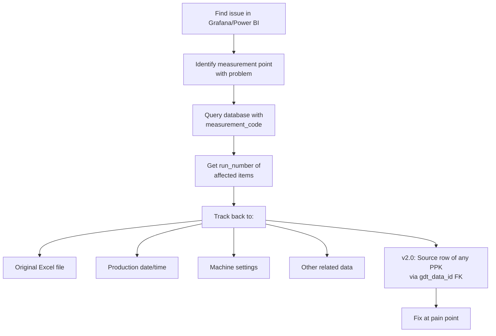

### Traceability Queries

**1. Find items with NG at specific point:**

```sql
SELECT
    h.run_number,
    h.file_name,
    h.log_date,
    h.model_type,
    h.temp_value,
    d.value,
    d.quality_status
FROM spc_gdt d
JOIN spc_header h
    ON d.run_number = h.run_number
WHERE d.production_line = 'Line_01'
  AND d.measurement_code = 'Line_01_MTG_1_211'
  AND d.quality_status = 'NG'
  AND d.data_type IN ('LH', 'RH')
ORDER BY d.log_date DESC
```

**2. v2.0: Trace any PPK value back to source row:**

```sql
SELECT
    s.run_number,
    s.measurement_code,
    s.PPK,
    s.ppk_status,
    s.sample_count,
    s.calculated_at,
    d.value AS source_value,
    d.log_date AS source_log_date,
    h.file_name AS source_file
FROM spc_gdt_stats s
JOIN spc_gdt d ON s.gdt_data_id = d.id
JOIN spc_header h ON d.run_number = h.run_number
WHERE s.PPK < 1.0
  AND s.production_line = 'Line_01'
ORDER BY s.calculated_at DESC
```

**3. Get all data for specific item:**

```sql
SELECT * FROM spc_header
WHERE run_number LIKE 'Line_01-23042026-ABC123DEF%'

SELECT * FROM spc_gdt
WHERE run_number LIKE 'Line_01-23042026-ABC123DEF%'
ORDER BY measurement_code
```

### Benefits of Traceability

| Benefit | Description |
|---------|-------------|
| **Root Cause Analysis** | Find which items have problems |
| **Batch Tracking** | Identify all items from same period |
| **Customer Response** | Quick answer when customer asks about specific item |
| **Process Improvement** | Find pattern in problem items |
| **Audit Compliance** | Full history of all measurements |
| **🆕 PPK Lineage (v2.0)** | Trace any PPK back to its 125 source samples |

---

## 13. Adding New Production Line

Each production line has its own main script because measurement data and points are different. When adding a new line, create new code referencing from existing line.

### Why Each Line Has Own Script

| Reason | Description |
|--------|-------------|
| Different measurement points | Each line measures different locations |
| Different specification limits | Tolerances vary by product design |
| Different Excel format | Camera output columns may differ |
| Different file naming | Filename pattern may vary |

### Steps to Add New Line

#### Step 1: Copy Code from Reference Line

```bash
cp MainSPC_Line_01.py MainSPC_Line_NEW.py
```

Other files are shared (no need to copy):
- `unified_qc_insert.py`
- `statistics_calculator.py` (v2.0)
- `spec_loader.py`
- `SPCLogger.py`

#### Step 2: Update Main Script

```python
# Change production line
PRODUCTION_LINE = "Line_NEW"

# Update directory variable
directory_path = get_path("Line_NEW_DIRECTORY", create_if_missing=False)

# Update filename pattern (if different)
def is_valid_filename(filename):
    pattern = r'^Line_NEW_*.xlsx$'
    return bool(re.match(pattern, filename, re.IGNORECASE))

# Update DATA_MAP if Excel structure differs
Line_NEW_DATA_MAP = {
    "gdt_sheet": "GD&T Data",
    "gdt_cols": "E,I,U",
    "gdt_skiprows": 21,
    "gdt_nrows": 372,
    # ... etc
}
```

#### Step 3: Add Specifications to Database

```sql
INSERT INTO spc_specs
(production_line, measurement_code, measurement_name, measurement_type,
 spec_min, spec_max, point_group, is_active, created_date)
VALUES
('Line_NEW', 'Line_NEW_MTG_1_211', 'Position MTG 1-211', 'GDT', -2.5, 2.5, 'LH', 1, GETDATE()),
('Line_NEW', 'Line_NEW_MTG_1_211', 'Position MTG 1-211', 'GDT', -2.5, 2.5, 'RH', 1, GETDATE())
-- ... add all specs
```

#### Step 4: Update .env Configuration

```ini
Line_NEW_DIRECTORY=D:\Data\Line_NEW_LOG
```

#### Step 5: Install and Test

```bash
python MainSPC_Line_NEW.py
```

Check:
- Specs loaded correctly
- Files detected
- Data inserted to database
- All 7 tables populated (v2.0 verification)
- No errors in log

#### Step 6: Install as Service (if needed)

```bash
nssm install SPC_Line_NEW "C:\Python310\python.exe" "C:\SPC_System\MainSPC_Line_NEW.py"
nssm start SPC_Line_NEW
```

### Checklist for New Line

- [ ] Copy and rename main script
- [ ] Update PRODUCTION_LINE variable
- [ ] Update directory variable
- [ ] Update filename pattern (if different)
- [ ] Update DATA_MAP (if Excel structure differs)
- [ ] Insert specs to spc_specs table
- [ ] Add directory to .env
- [ ] Test with sample Excel file
- [ ] Verify all 7 tables populated (v2.0)
- [ ] Add to Grafana dashboards
- [ ] Add to Power BI reports
- [ ] Install as Windows service
- [ ] Document the new line

### Database — No Changes Needed!

The universal database design means:
- ✅ No new tables needed
- ✅ Just add data with new `production_line` value
- ✅ Grafana/Power BI queries work automatically (filter by line)
- ✅ Same applies to v2.0 statistics tables

---

## 14. Troubleshooting

### Common Issues and Solutions

#### Issue 1: Service Won't Start

**Symptoms:** Windows service fails to start.

**Solutions:**
1. Check Python path is correct in NSSM
2. Check .env file exists and is readable
3. Run script manually to see error
4. Check log file for errors

---

#### Issue 2: Files Not Being Processed

**Symptoms:** New Excel files appear but not processed.

**Solutions:**
1. Check filename pattern matches the line's regex
2. Check file is not already in processed log
3. Check file modification date is within `LOOKBACK_DAYS`
4. Check folder permissions

---

#### Issue 3: Database Connection Failed

**Symptoms:** "Could not connect to database" or "No compatible driver found".

**Solutions:**
1. Install ODBC Driver 17 or 18
2. Check `DB_SERVER` IP is correct
3. Check `DB_USER` and `DB_PASS`
4. Test connection with SQL Server Management Studio
5. Check firewall allows port 1433
6. **v2.0:** System will auto-retry 3 times before giving up

---

#### Issue 4: PPK Shows NULL for All Points (v2.0)

**Symptoms:** PPK/PP values are all NULL in `spc_gdt_stats`.

**Solutions:**
1. Need at least 2 samples (MIN_SAMPLES_FOR_PPK = 2)
2. Check if data is being inserted correctly
3. Check spec limits in `spc_specs` table
4. Check console for debug counters:
   ```
   [PPK] GDT: calculated=X, no_spec=Y, no_data=Z, std=0=W
   ```
5. If `std=0` is high, all samples have the same value (genuinely NULL PPK)
6. If `no_spec` is high, specs are missing from `spc_specs` table

---

#### Issue 5: All Status Shows N/A

**Symptoms:** `quality_status` is N/A for all records.

**Solutions:**
1. Check specs loaded correctly via console output
2. Check `spc_specs` table has specs for this line
3. Delete spec cache and reload:
   ```bash
   del Line_xx_Log\Specs\Specs_Line_xx.xlsx
   python MainSPC_Line_xx.py
   ```

---

#### Issue 6: Excel File Read Error

**Symptoms:** "Failed to read Excel file" or "Sheet not found".

**Solutions:**
1. Check Excel file is not corrupted
2. Check sheet names match `DATA_MAP`
3. Check file is not open in Excel
4. Check skiprows / nrows match the actual file structure

---

#### Issue 7: Duplicate Records in Database

**Symptoms:** Same file processed multiple times.

**Solutions:**
1. Check `processed_files_log.xlsx` exists
2. Check SQL database connection for duplicate check
3. Verify `LOOKBACK_DAYS` is not too short

---

#### Issue 8: Spec Limits Wrong

**Symptoms:** OK items showing as NG, or NG showing as OK.

**Solutions:**
1. Check `spc_specs` table values
2. Verify `point_group` (LH/RH) is correct
3. Delete spec cache to reload from SQL:
   ```bash
   del Line_xx_Log\Specs\Specs_Line_xx.xlsx
   ```
4. Check spec lookup in console output

---

#### Issue 9: Slow Performance

**Symptoms:** Processing takes too long.

**Solutions:**
1. Check network connection to SQL Server
2. Add indexes to database:
   ```sql
   CREATE INDEX IX_GDT_Lookup ON spc_gdt
   (production_line, measurement_code, data_type, log_date)

   CREATE INDEX IX_GDT_Stats_Lookup ON spc_gdt_stats
   (production_line, measurement_code, data_type, calculated_at)
   ```
3. Check if `skip_zeros` is enabled
4. Increase `COUNTDOWN_SECONDS` if processing too frequently

---

#### Issue 10: PySpark Spec Loading Fails (v2.0)

**Symptoms:** `[WARN] PySpark JDBC failed: ...`

**Solutions:**
1. **This is OK** — system automatically falls back to pyodbc
2. To use PySpark, install: `pip install pyspark`
3. Download Microsoft JDBC driver and add to Spark classpath
4. Verify Java is installed (PySpark requires JVM)
5. If you don't need PySpark, ignore the warning

---

#### Issue 11: Verification Says Tables MISSING (v2.0)

**Symptoms:** `[VERIFY] spc_gdt_stats: 0 rows [MISSING]`

**Solutions:**
1. Check console for upstream errors during stats calculation
2. Check if `MIN_SAMPLES_FOR_PPK` was met
3. Check if specs exist in `spc_specs`
4. Run will be added to retry queue automatically
5. If retry also fails, check SQL connection stability

---

#### Issue 12: Memory Usage High

**Symptoms:** Python process uses too much RAM.

**Solutions:**
1. Restart service periodically (weekly)
2. Check Excel file sizes — very large files may cause issues
3. PySpark adds memory overhead — disable if not needed

---

### Getting Help

If issues persist:

1. **Check Logs** — `{Line}_Log/Logs/SPC_Log_*.xlsx`
2. **Run Manually** — Stop service, run `python MainSPC_{Line}.py`
3. **Enable Debug** — Add print statements to code
4. **Check Database** — Verify data in SQL tables
5. **Test Components** — Run individual modules to isolate issue

---

*Last Updated: April 2026 (v2.0 release)*
